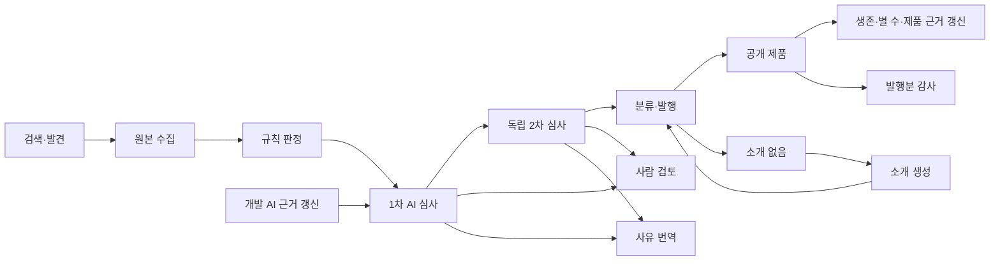

# 전체 파이프라인 병목 검토

2026-09-21 17:08 KST. 운영 `8ec1adc`, 로컬 `5146d13`. 사용자 요청은 전체 과정 검토와 보고이며 코드·운영 데이터·설정·배포를 변경하지 않았다.

**신규 수집·심사·발행은 진행되지만, 전체 기능이 모두 정상이라고 볼 수는 없다.** 우선 해결할 것은 근거 수집의 반복 실패와 승인 후보의 근거 갱신 대기, 기존 발행분 감사 중단이다. 상태 확인·별 수 갱신은 현재 제품 규모에 비해 처리 상한이 작다. CPU나 DB 연결 증설보다 큐 복구·우선순위·갱신 처리량 조정이 먼저다.

로그 표본: **15:50–16:50 KST, 1시간**, 최종 롤링 배포 이후의 고정 구간. DB 상세 스냅샷은 17:02–17:04 KST다. [원본 집계와 재현 결과](evidence.json)를 함께 보관했다. `systematic-debugging` 절차로 증상→데이터→코드→읽기 전용 재현 순서로 확인했다.

## 1. P1 — 개발 AI 근거 수집의 잘못된 진행 정보가 반복 선택됨

**확정:** 1시간 동안 `agent_evidence.failed` 132회가 저장소 3개에 집중됐다. 각각 44회다.

| 스캔 행의 저장소 | 저장된 cursor의 저장소 |
|---|---|
| hraness/atet | hraness/slopcamera |
| hraness/hra | hraness/oompa |
| hraness/message-like-me | hraness/textbutler |

운영 DB에서 진행 정보만 읽어 실제 `collectRepositoryAgentEvidence`에 전달했다. 외부 요청을 금지한 stub으로 **3/3 모두 `invalid agent scan cursor`, 외부 호출 0회**를 재현했다. `collect.ts:49`의 저장소 동일성 검사에서 실패한다.

문제는 잘못된 정보를 거부하는 검사 자체가 아니다. `agent-evidence-refresh.ts`는 이어서 수집할 후보를 오래된 순으로 3개 우선 선택한다. catch에서는 `Error`라는 이름만 기록하고 재시도 시각·진행 정보를 정리하지 않는다. 세 행은 `last_error_code=null`, `partial`로 남아 우선 재개 슬롯 3개를 계속 차지한다. 일반 검색 경로의 수집은 이어지므로 전체 수집이 멈춘 것은 아니다.

저장 경로도 불일치를 만들 수 있다. `agents/repository.ts:71`의 upsert 충돌 키는 GitHub repository ID·commit SHA·탐지기·scope이며, 충돌 시 cursor를 교체하지만 repositoryKey는 교체하지 않는다. 별칭/이름 변경이 동일 ID로 들어오면 이런 조합이 가능하다. **현재 실패 조건과 반복 선택은 재현했지만, 최초 불일치를 만든 운영 쓰기를 재생한 것은 아니다.**

권장: GitHub ID를 기준으로 저장소 이름과 cursor의 일관성을 보장하고, 부적합한 cursor는 기존 완료 근거를 보존하며 재수집 대상으로 전환한다. 예외는 안전한 원인 코드·다음 재시도 시각을 남기고, 같은 3건이 매 회차 우선 슬롯을 독점하지 못하게 해야 한다.

## 2. P1 — 근거 갱신 적체가 승인 후보의 재심사·발행을 막음

17:04 스냅샷의 승인 후보 **92건 전부 최신 1차 결과가 만료**됐고, **91건의 최신 스캔이 24시간 초과**였다. 그중 **90건은 원본 문서가 최신인데 스캔만 오래됐다.** 분류 실패 보류는 0건이다. 따라서 승인 목록의 숫자를 전부 분류·발행 처리량 부족으로 해석하면 안 된다.

`agent-review-repository.ts:226–233`은 기존 스캔 완료 시각이 24시간을 넘으면 1차 재심사 대상에서 제외한다. 반면 `requeueStaleReviewSources`는 오래된 원본 문서만 다시 수집하도록 요청한다. 최신 문서+오래된 스캔 조합은 이 복구 경로로 풀리지 않아 일반 근거 스캔 순서를 기다린다. 현재 `agentEvidence.enforceEligibility=false`여도 이 최신성 조건은 적용된다.

실제 근거 수집 수요 **18,223개** 중 **14,490개가 갱신 대상**, **3,065개는 스캔 없음**, **4,108개는 partial**이다(집합은 중복 가능). 최근 1시간 complete 스캔 로그는 129회이며, 이 중 rate_limited 2회를 제외한 오류 없는 complete 관측은 127회다. 이는 고유 저장소의 지속 가능 처리 용량을 뜻하지 않는다.

권장: 승인·재심사를 막는 저장소의 근거 갱신을 명시적으로 요청하고, 새 후보와 부분 수집 재개의 처리량을 보장한다. 일반 제품의 24시간 갱신은 별도 몫을 둔다. 신선도·두 모델 승인 조건을 낮춰서 통과시키는 방식은 피한다.

## 3. P1 — 기존 발행분 감사가 정책 불일치로 중단됨

감사 캠페인 3은 DB상 `running`이지만, **1시간 59회 모두 `policy_changed`로 건너뛰었다.** 캠페인 프롬프트/규칙은 `2026-09-19.3 / 2026-09-19.2`, 현재 코드는 `2026-09-21.3 / 2026-09-21.2`다.

감사 항목 11,558개 중 **5,176개는 AI 판단이 없고**, 6,382개는 AI 판단 후 사람 결정이 없다. `product-audit.ts:43` 부근의 버전 보호가 의도대로 중단시키지만, 정상 반환이므로 작업은 성공으로 기록된다. 모델 속도나 서버 용량 때문에 진행이 없는 상태가 아니다.

권장: 운영자가 기존 캠페인을 명시적으로 종료하고 현재 정책으로 새 캠페인을 열어야 한다. 오래된 결과는 보존하고, 운영 화면에 `정책 변경으로 중단`을 별도 상태로 표시한다. 이번 검토에서는 캠페인을 변경하지 않았다.

## 4. P1 — 웹사이트 생존 확인은 6시간 목표를 구조적으로 충족 못 함

- 대상 웹사이트 **16,845개**, 6시간 초과 **13,102개(77.8%)**.
- 확인 결과 나이 중앙값 **12.71시간**, 최장 **38.83시간**.
- 실제 **900건/시간**(60회 × 15건), 소요 중앙값 3.81초.
- 전부 6시간마다 보려면 **약 2,808건/시간**이 필요하다. 현재 상한으로 한 바퀴는 약 **18.7시간**이다.

원인은 `uptime.ts`의 BATCH=15와 1분 주기다. 코드 주석의 3,147개 기준 용량 계산이 현재 규모와 맞지 않는다. maintenance의 작업 실행 시간 합은 1시간의 약 16.5%여서 현재는 워커 시간이 아니라 배치 상한이 먼저 막는다. 설치형 377개는 확인 대상에서 의도적으로 제외되므로 never_checked를 장애로 세지 않았다.

영향: 제품 상세의 최근 상태 표시가 만료되고 장애·복구 발견이 늦어진다. 권장: 규모에 맞춰 처리량을 최소 3.2배 확보하되, 동일 origin 직렬화와 사이트별 최소 6시간 간격을 유지한다. 더 큰 제한 배치나 준비된 잔여 작업의 연속 실행을 검토할 수 있다.

## 5. P2 — 별 수 갱신 상한 부족과 GitHub 공유 한도

- 별 수 갱신 대상 **17,222개**, 24시간 초과 **6,773개**, 당장 갱신 대상 6,771개.
- 값의 나이 중앙값 **19.98시간**, p95 **40.71시간**.
- 전용 별 수 작업의 실제 갱신 **328건/시간**, 코드 상한 **40건 × 12회 = 480건/시간**.
- 하루 한 번 갱신에 필요한 속도는 **약 718건/시간**이다. 다른 갱신 경로의 도움 없이 전용 작업만으로는 목표를 충족하지 못한다.

같은 1시간에 GitHub primary 한도 로그 3개, 원본 수집 한도 대기 8회, 별 수 작업 한도 대기 2회가 있었다. primary 한도 07:06 관측은 reset 07:18:48을 가리켰다. 이들은 고유한 제한 사건 수와 같지 않다.

제품 근거 갱신은 1,018회 시도 중 실패 집계 342회이며, 소스 로그에서 저장소 갱신 실패 342회를 확인했다. 이후 DB에는 rate_limited 저장소 근거 329개가 남아 있었다. 과거 실패 전부가 rate limit 때문이었다고 단정하지는 않는다. crawler 작업 시간 중 제품 근거 갱신이 1,527초(전체 1시간의 42.4%)를 차지했다.

권장: 원본·별 수·제품 근거·개발 AI 근거의 GitHub 예산을 함께 배분하고, 이미 받은 저장소 메타데이터를 중복 요청하지 않도록 공유한다. 이후 별 수 배치/주기를 조정한다. 공유 한도에 걸리는 상태에서 동시성만 올리는 것은 우선순위가 낮다.

## 6. P2 — 단계 사이 대기와 텍스트 후처리

1차·2차·규칙·발행분 감사는 reviewer 하나에서 직렬로 실행된다. `worker.ts:68`은 poll 시작 시 pending 목록을 한 번만 읽으므로, 1차 실행 중 생긴 2차 요청은 다음 poll까지 기다릴 수 있다. 먼저 시작한 다른 작업은 선점하지 않는다.

로그에서 짝지은 **57건의 1차 저장→2차 모델 시작**은 중앙값 **7.80초**, p95 **39.74초**, 최장 **50.70초**다. 같은 1차 job이 끝나기를 기다린 부분은 중앙값 1.00초/p95 16.52초, job 종료 이후 나머지는 중앙값 5.28초/p95 32.42초다. 각 부분의 분위수 합은 전체 분위수와 다르다.

현재 reviewer 작업 시간은 약 **16.7%**, publisher는 **6.9%**이고, 2차 pending/failed 큐는 스냅샷에 없었다. 모델 호출은 1차 79회/실패 3회(중앙값 9.33초), 2차 61회/실패 4회(중앙값 5.77초)다. 전체를 모델 처리 용량 부족으로 판단할 근거는 없다. 후속 요청을 작업 경계에서 다시 확인하는 방식으로 지연을 줄일 여지는 있다. 공유 모델 동시 호출 한도는 보존해야 한다.

사유 번역은 **미처리 2,515개+실패 1개**, 가장 오래된 미처리 약 **211시간**이다. 시간당 451개를 번역했으며 최근 1시간 원문 해시는 109개였다(집계 창은 정확히 같지 않음). 신규 유입이 없고 같은 처리량이 지속된다면 현재 미처리만 약 5.6시간 분량이다. 최신순 선택으로 오래된 사유가 뒤로 밀릴 수 있다. 번역은 발행 워커와 분리돼 직접 발행 시간을 점유하지 않는다.

소개 생성은 1시간 6건 성공, 자동 실행 가능 큐 0건이다. `no_description` 61건은 모두 생성 결과가 빈 줄이어서 사람 판단에 남았다. 단순히 생성 작업을 더 돌려서 처리할 큐가 아니다.

**잠재 결함:** 소개 작업은 자체 예산 54초/호출 상한 45초를 가정하지만 `jobRunOptions('crawl-tagline')`는 별도 예산을 반환하지 않아 runner 기본 **25초**가 적용된다. 실제 함수 호출로 확인했다. 긴 요청은 25초 경계에서 취소되어 결과 저장 없이 재시도될 수 있다. 이번 6건은 빠르게 끝났으므로 현재 적체의 원인으로 세지 않았다. 예산 일치와 느린 응답 회귀 검증이 필요하다.

## 7. 사람 판단은 별도 병목

스냅샷 기준 needs_review는 **902건**: ambiguous 436, 두 모델 의견 불일치 405, 소개 근거 부족 61. 최장 후보 나이는 약 260시간이다. 별도 2차 화면의 needs_human 472건·agreed 213건은 이 집합과 중복할 수 있으므로 더하면 안 된다.

이번 24시간 관리자 감사 로그에는 재검토·중복 정리 등이 있었지만, 수동 승인/거절 처리에 해당하는 액션은 나타나지 않았다. 이를 자동 발행 속도 문제로 취급하지 말고 사유별 검토 담당과 처리량을 정해야 한다. 유효한 기존 결정을 유지한 채 현재 입력·정책 기준으로 검토할 목록을 제공하는 것이 필요하다.

## 정상 진행 구간·용량 판단

| 구간 | 확인 |
|---|---|
| 검색·원본 수집 | 1시간 신규 발견 252, 수집 272, 수집 실패 0. 현재 frontier pending/fetching 0. 10분 탐색 주기는 코드상 의도적 유입 조절 |
| 규칙 판정 | 260건, 작업 중앙값 0.30초. 큐 적체 없음 |
| 분류·발행 | 36건 발행. 분류 실패 보류 0, publisher 작업 시간 약 6.9% |
| 이미지·검색 문서 | 이미지 462개 검사/461개 채움/실패 0, 검색 문서 78개 갱신 |
| 집계·랭킹·소식 | 각각 실행 관측, 집계·랭킹 각 약 0.03초. 랭킹 entries=0은 그대로 기록하며 오류라고 단정하지 않음 |
| DB·자원 | 조회 시 DB 106/150연결, 해당 앱 6, Lock 대기 0. 컨테이너 순간 CPU 최고 3.04%, 메모리 사용률 최고 38.03%. 순간 표본으로 피크 부하 여유까지 보장하지 않음 |

워커 점유율은 로그 완료 시각 기준 실행 시간 합이며 CPU 사용률이 아니다. 관측 경계를 걸친 job 때문에 소폭 오차가 있다. 각 job의 last_error가 없다는 사실은 개별 수집 실패나 정책 변경으로 중단된 감사를 부정하지 않는다. 운영센터에는 **실제 성공/실패·큐 나이·중단 이유**가 필요하다.

## 권장 실행 순서와 확인 기준

1. **근거 cursor 불일치·반복 선택 복구**: 3개 재현 케이스 통과, 해당 반복 예외 0, 다른 partial의 진행 재개. 오래된 완료 근거·저장소 정체성을 보존한다.
2. **발행을 막는 근거 갱신 우선 처리**: 최신 문서+오래된 스캔 90건이 재심사 가능 상태로 이동하는지 확인한다. 모델 판단이 달라지므로 90건 발행을 성공 기준으로 삼지 않는다.
3. **감사 캠페인 정책 전환**: 현재 정책의 새 캠페인에서 미평가 건수가 감소하고 구 정책 결과가 섞이지 않는지 확인한다.
4. **상태 확인·별 수 처리량 재산정**: 상태 확인은 6시간, 별 수는 24시간 초과 건수가 실제로 감소하는지 관측한다. GitHub 예산과 타 사이트 요청 간격을 지킨다.
5. **단계 대기·텍스트 보완**: 후속 작업 시작 p95, 번역의 가장 오래된 대기, 소개 25초 예산 불일치를 각각 검증한다.

기능 테스트는 직전 점검에서 단위1,094/통합767개가 통과했다. **이번 검토에서 전체 테스트를 재실행하지 않았다.** 이번에는 운영 read-only SQL·6,180개 로그 분석·실제 collector의 cursor 3건 재현·소개 예산 함수 호출을 수행했다. 코드 변경이나 배포, 데이터 복구는 하지 않았다.

재현 스크립트의 `.txt` 원본을 이 디렉터리에 보관했다. 실행본은 ignored `.crawl-samples/review-speed/bottleneck-*`, 수집·집계 도구는 `/tmp/nmv-bottleneck-{logs,summary}.py`다. SQL 재현 중 정규식 역참조를 JS tagged template에서 한 번만 이스케이프해 오류가 났으며, 두 번 이스케이프한 뒤 정상 실행했다. 생산 기능의 SQL 오류가 아니다.
