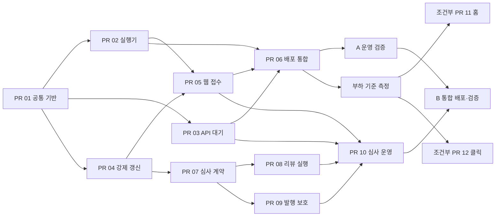

# 독립 워커 병렬 개발 — PR Implementation Plan

> **For agentic workers:** 사용자 요청에 따라 PR별 서브에이전트가 별도 worktree에서 병렬 개발한다.
> 주 조정자는 공통 계약·마이그레이션·통합 리뷰·배포 전환을 담당한다. 체크박스는 구현 시 진행 기록이다.

**Goal:** 기존 수집 코드를 보존하면서 웹과 독립된 상시 워커를 운영하고, 크롤링 후보의 AI 심사와 유효 승인에 따른 발행을 추가한다.

**Architecture:** 기존 jobs/frontier/documents/candidates와 PostgreSQL 트랜잭션을 재사용한다.
공통 실행기와 worker 이미지에서 역할을 나누고, 실행 경계 분리(A) → AI 심사(B) → 실측 병목 개선(C)으로 진행한다.

**Tech Stack:** Next.js 16.3.1, TypeScript/tsx, PostgreSQL 17, Drizzle, 기존 Claude CLI 연결, Vitest, Playwright, Docker Compose.

---

## 1. 기준과 결과물

- 기준 설계: `docs/superpowers/specs/2026-09-08-independent-workers-and-capacity-design.md`.
- 확인한 HEAD: `9c84bb9`. 2026-09-08의 현재 미커밋 홈·인증·Compose 변경도 읽기 전용으로 확인했다.
- 이번 결과물은 구현 계획이다. 서비스 코드·DB·실행 프로세스·배포를 변경하지 않는다.
- **필수 PR은 A 6개 + B 4개, 총 10개다.** 성능 PR 11·12는 기준 측정 후 필요할 때 진행한다.
- PR 병렬 개발은 런타임 크롤러 복제본 확대와 다르다. 배포 초기에는 역할당 활성 프로세스 1개,
  한 번에 잡 1개, AI 리뷰 동시 호출 1개를 유지한다.
- A 완료는 독립 운영, B 완료는 AI 심사와 발행 보호까지다. 상시 실행은 호스트 장애까지 포함한 무중단 보장이 아니다.

공개 등록·verify·메이커 202 갱신, 제품/후보 상태, 소유권 정책, 랭킹 산식, 이미지 DB 저장,
기존 개발 AI 탐지기를 유지한다. 새 범용 큐·Redis·전체 원본 버전 저장소·다중 AI provider 프레임워크는 만들지 않는다.
새 도메인 테이블은 `product_refresh_requests`, `crawl_review_attempts` 두 개로 한정한다.

## 2. PR 목록과 의존성

PR 번호는 이 계획의 식별자이며 아직 GitHub에 생성된 PR 번호가 아니다.

| PR | 결과 | 선행 PR / 조건 | 주 담당 |
|---|---|---|---|
| 01 | jobs 요청·잠금·스케줄 공통 계약 | 기준 작업 트리 확인 | 기반 |
| 02 | 독립 scheduler·worker·CLI | 01 | 실행기 |
| 03 | 공유 GitHub 대기·적체 시 탐색 감속 | 01 | 수집 |
| 04 | 관리자 force 갱신 요청·부분 재개 | 01; 03과 대기 계약 합의 | 근거 |
| 05 | cron/어드민 접수·진행 화면 | 02, 04 | 웹 |
| 06 | worker 이미지·DB 한도·배포와 운영 검증 | 02, 03, 05 | 통합/운영 |
| 07 | AI 심사 입력·이력·모드 계약 | 04까지 스키마 통합; 06의 A 검증 후 B 전환 | 심사 기반 |
| 08 | 구조화 AI 리뷰·재시도 실행 | 07, 02 | 리뷰 |
| 09 | 유효 승인 필터·발행 트랜잭션 검사 | 07, 01 | 발행 |
| 10 | 심사 어드민·제한 재수집·B 검증 | 08, 09, 05, 03 | 웹/통합 |
| 11 | 홈 집계 재사용 | 06 측정 + 기존 홈 변경이 기준 커밋에 포함됨 | 조회 |
| 12 | 방문 집계 시작 행의 반복 쓰기 감소 | 06 측정 | 지표 |



핵심 경로는 `01 → (02·03·04 병렬) → 05 → 06 → A 검증`과
`07 → (08·09 병렬) → 10 → B 검증`이다. PR 07은 A 후반과 병렬로 준비할 수 있지만,
B의 운영 전환은 A 검증 뒤다. PR 06의 이미지 초안도 PR 02의 실행 명령 확정 후 준비할 수 있다.

## 3. 병렬 작업 운영 규칙

현재 가능한 배치는 **주 조정자 1명 + 구현 서브에이전트 최대 3명**이다. 동시 슬롯을 구현에
사용한 뒤 완료 에이전트를 교차 리뷰에 재배정한다. 한 에이전트가 다른 에이전트의 파일을 수정하지 않는다.

| 차수 | 에이전트 1 | 에이전트 2 | 에이전트 3 | 주 조정자 |
|---|---|---|---|---|
| 준비 | PR 01 구현 | 다음 PR 요구사항 읽기 | 검증 사례 읽기 | 기준/계약 확인, PR 01 리뷰 |
| A 병렬 | PR 02 | PR 03 | PR 04 | 마이그레이션 직렬 통합, 교차 리뷰 |
| A 통합 | PR 05 | PR 06 준비 | PR 07 준비 | 05·06 통합, A 검증 |
| B 병렬 | PR 08 | PR 09 | PR 10의 UI를 고정 DTO로 준비 | 07 계약 유지, 리뷰 |
| B 통합 | PR 10 통합 | 08 교차 리뷰 | 09 교차 리뷰 | 실제 10개·24시간 검증 |
| 측정 후 | PR 11 필요 시 | PR 12 필요 시 | 변경 전후 측정 | 결과 비교·선택 적용 |

**시작 전 기준 정리**

- [ ] `git status --short`와 `git diff --name-only`로 기존 변경을 기록한다. 기존 작업을 reset/stash하거나
  일괄 커밋해서 워커 PR에 섞지 않는다.
- [ ] A/B는 선택한 기준 커밋에서 별도 worktree를 만든다. 미커밋 `compose.yml`, `.env.example`의
  필요한 변경은 PR 06 담당이 기존 작업과 대조하여 선택 통합하고 출처를 PR에 적는다.
  구현 기준 브랜치에는 이 계획 문서도 포함하여 새 worktree에서 같은 계약을 읽을 수 있게 한다.
- [ ] `lib/domain/products/home-pulse.ts`, `tests/home-pulse.test.ts`는 현재 untracked이다.
  깨끗한 HEAD worktree에 있다고 가정하지 않는다. 기존 홈 작업이 별도로 통합되기 전 PR 11은 시작하지 않는다.
- [ ] 각 에이전트에게 기준 SHA, PR 번호, 수정 허용 파일, 선행 계약, 테스트 DB, 완료 기준을 전달한다.
  상위 브랜치 변경은 파일 복사 대신 커밋으로 전달한다. PR 의존 브랜치는 부모 PR 통합 후 rebase한다.

**공통 파일 소유권**

| 공통 파일 | 수정/통합 규칙 |
|---|---|
| `lib/db/schema.ts`, `drizzle/`, `drizzle/meta/`, `tests/integration/setup.ts` | 주 조정자가 PR 01 → 04 → 07 순으로 통합. 에이전트가 동시에 migration 번호를 생성하지 않음 |
| `lib/jobs/control.ts`, `runner.ts` | PR 01 담당. 뒤 PR은 계약 변경 요청 후 순차 반영 |
| `lib/jobs/catalog.ts`, `registry.ts` | PR 01에서 기본 목록 확정, PR 08에서 리뷰 잡만 추가 |
| `lib/crawl/repository.ts` | PR 03의 최소 수집 재시도 변경 뒤 PR 07의 심사 저장 계약, PR 10의 관리자 확정 쓰기 보강 순서. PR 09는 새 발행 조회 파일에서 작업 |
| `lib/jobs/products/agent-evidence-refresh.ts` | PR 03에서 필요한 네트워크 연결 뒤 PR 10에서 제한 재수집 연결 |
| `package.json`, `package-lock.json`, `Dockerfile`, `compose.yml`, `.env.example` | PR 06 담당이 통합. PR 08 모델 환경 설정 문구는 이후 순차 반영 |
| `app/admin/actions.ts`, `SettingsForm.tsx`, `lib/crawl/settings.ts` | PR 07에서 서버 설정 계약, PR 10에서 화면/운영 동작 통합 |
| `docs/CODEX_HANDOFF.md` | 주 조정자만 단계 종료 시 갱신 |

**검증 자원**

- 단위 테스트는 worktree별 병렬 실행 가능하다. 통합 테스트는 전용 `TEST_DATABASE_URL`만 사용한다.
- 현재 통합 setup은 TRUNCATE, 일부 테스트는 jobs DELETE를 실행한다. `fileParallelism:false`는
  다른 에이전트의 Vitest 프로세스까지 직렬화하지 않는다. 기본 운영은 통합 담당이 한 번씩 실행하며,
  병렬 실행이 필요하면 PR별 DB를 따로 만든다.
- Playwright는 현재 포트 43127, `.next`, 기본 테스트 DB를 공유한다. E2E는 통합 담당이 직렬 실행한다.
  병렬화를 위해 전체 테스트 도구를 재작성하지 않는다.

## 4. 먼저 고정할 공통 계약

아래 이름은 신규 인터페이스 제안이다. 구현 시 PR 01/07에서 실제 타입으로 확정하고 종속 PR에 전달한다.

| 계약 | 구현 규칙 |
|---|---|
| `requestJob` | 허용된 이름의 실행 신호만 저장. 명시적 요청은 버전 증가. 호출자 DB 트랜잭션을 받아 force 요청과 함께 commit 가능 |
| `runJob` | 기존 handler/JobContext/JobOutcome 보존. 요청 소비 옵션을 추가하고 기존 직접 한 tick 호출은 호환. worker가 요청을 다시 생성하지 않음 |
| 소유권 전달 | 실행 중 job 이름·lease token·선점 요청 버전을 읽기 전용으로 전달. B의 리뷰/발행 쓰기에서 같은 DB 트랜잭션으로 검사 |
| 성공/실패 | done=false 성공도 선점 요청 버전 처리, cursor 유지. done=true만 cursor 초기화. 예외는 요청·cursor 보존, notBefore 재시도 |
| 스케줄 | DB 시각 사용. 동일 예정 시각 선점은 원자적. pending 정기 요청 병합, 예정 시각은 처리시간 때문에 밀리지 않음 |
| `queueProductRefresh` | 제품 ID/세대·actor·force·요청 버전 기록과 product-evidence-refresh 요청을 원자적으로 저장. 접수 DTO는 productId/requestedVersion |
| `ReviewInput` | 원본의 제한된 복사본, 근거 ID, URL/관계, scan ID/SHA, 룰·detector·prompt·심사 정책 버전. 일정한 직렬화로 hash 계산. 리뷰가 쓴 state/updatedAt은 의미 hash에서 제외하고 CAS 스냅샷으로 별도 비교 |
| 심사 유효성 | 입력 hash와 적용 정책/version을 공유하며, 별도로 최신 원본·근거 freshness·관리자 결정·실행 소유권을 검사. 단순 TTL 캐시로 승인하지 않음 |
| `recordAgentReview` | 이력과 후보 상태 적용을 원자적으로 처리. 최신 입력/CAS/관리자 결정/lease 검사. observe에서는 이력만 기록 |
| 발행 조회 | 유효한 현재 승인 조건을 LIMIT보다 먼저 적용. 최종 guard에서 동일 조건 재검사. AI 대기는 기존 발행 실패 상태변경 함수로 보내지 않음 |

버전의 DB 타입과 HTTP 직렬화는 PR 01에서 함께 고정한다. 큰 정수를 JSON number로 조용히 잘라
버전 비교가 달라지게 하지 않는다. 여러 행을 잠그는 경로는 기존 후보→원본→설정 잠금과 호환되는
순서로 정하고, lease/심사 행까지 포함한 획득 순서를 PR 07·09가 공유한다. AI/HTTP 호출 중 DB 잠금을 유지하지 않는다.

## 5. A — 기존 잡의 독립 운영

### PR 01 — 실행 신호·소유권과 작업 카탈로그

**변경:** `lib/jobs/runner.ts`, `lib/jobs/registry.ts`, `lib/db/schema.ts`, `tests/integration/job-runner.test.ts`.
**신규:** `lib/jobs/control.ts`, `lib/jobs/catalog.ts`, `tests/integration/job-control.test.ts`.
**마이그레이션:** `drizzle/0020_job_control.sql` 및 대응 meta. 현재 마지막은 0019이며 다른 migration이 먼저
통합되면 번호는 조정자가 재배정한다. 뒤 PR도 같은 규칙이다.

- [ ] 테스트에 실행 중 재요청, 동일 예정 시각 경합, 이전 token의 save/release 거부를 추가하고 실패를 확인한다.
- [ ] jobs에 requestedVersion/processedVersion/nextScheduledAt/notBefore/leaseToken/workerSeenAt을 가산한다.
  cursor·기존 상태와 행을 보존하고 catalog는 실행 handler를 import하지 않는다.
- [ ] 15초 lease 갱신, 기존 10분 stale 회수, 소유권 상실 시 hasBudget=false를 구현한다.
  유휴 관측은 lease를 연장하지 않는다. 실패와 의도적인 API 대기를 구분한다.
- [ ] click-rollup의 done=true 성공 기록과 ranking-refresh 요청을 같은 완료 트랜잭션에 넣는다.
  실패/부분 완료는 랭킹을 요청하지 않는다. 정기 ranking 요청은 scheduler가 독립 생성하지 않는다.
- [ ] cursor 재개/부분 성공/실패 대기/집계 후 요청 원자성 테스트를 통과시키고 PR로 제출한다.

검증: `npm run test:integration -- tests/integration/job-runner.test.ts tests/integration/job-control.test.ts`.
완료: 실행 도중 들어온 요청이 남고, 오래된 실행자가 새 실행의 cursor/잠금을 덮지 않는다.
롤백: 가산 컬럼을 보존하는 호환 코드로 복귀한다. token 검사만으로 모든 수집 결과 쓰기가 보호됐다고 주장하지 않는다.

### PR 02 — 독립 스케줄러와 역할별 실행기

**신규:** `scripts/worker.ts`, `scripts/scheduler.ts`, `tests/worker-runtime.test.ts`, `tests/scheduler-runtime.test.ts`.
**변경:** `scripts/run-job.ts`, `scripts/evidence-worker.ts`, `scripts/scheduler.sh`,
`tests/evidence-worker.test.ts`, `tests/evidence-scheduler.test.ts`.

- [ ] 가짜 시계와 주입된 실행 함수로 역할별 순차 실행, scheduler 중복, SIGTERM 테스트를 먼저 작성한다.
- [ ] scheduler 10초 poll, crawler/reviewer/publisher/maintenance 역할 선택, crawler round-robin을 구현한다.
  주기는 fetch/evidence 1분, judge/publish 5분, seed 15분, uptime 10분, rollup 1시간을 유지한다.
- [ ] `scripts/worker.ts --role=crawler`와 `scripts/scheduler.ts`를 실행 계약으로 고정한다.
  `--once`는 한 번의 제한된 처리 회차이며 큐 전체 소진이 아니다. worker만 돌려서는 새 정기 요청이 생기지 않는다.
- [ ] 기존 CLI를 같은 잠금/요청 경로의 wrapper로 유지한다. 이전 HTTP shell 루프를 새 scheduler와 동시에 돌리지 않는다.
  SIGTERM 시 새 잡을 받지 않고 현재 tick·자식 프로세스 종료 후 pool을 닫는다.
- [ ] scheduler 생존 관측과 worker 유휴 관측을 구분하고, 테스트·종료 로그 증거를 제출한다.

검증: `npm test -- tests/worker-runtime.test.ts tests/scheduler-runtime.test.ts tests/evidence-worker.test.ts tests/evidence-scheduler.test.ts`.
완료: 하나의 역할이 느려도 다른 역할의 요청 처리가 이어지고, backoff 동안 스케줄 요청이 폭증하지 않는다.
롤백: 새 소비자를 종료 확인한 뒤 동일 버전 계약을 사용하는 wrapper로 전환한다.

### PR 03 — GitHub 공유 대기와 탐색 적체 제어

**신규:** `lib/crawl/github-quota.ts`, `tests/github-quota.test.ts`, `tests/integration/github-quota.test.ts`.
**변경:** `lib/crawl/github.ts`, `lib/crawl/jobs/fetch.ts`, `lib/crawl/jobs/seed.ts`,
`lib/crawl/repository.ts`, `tests/integration/crawl-fetch.test.ts`, `tests/integration/crawl-seed.test.ts`.
공통 client를 이미 쓰는 evidence provider는 호출 계약 변경이 필요할 때만 해당 소유자와 연결한다.

- [ ] 서로 다른 잡의 호출·재시작·primary/secondary 제한·304 응답을 검증하는 테스트를 작성한다.
- [ ] 기존 `rate_limits`의 분리된 key namespace에 credential/resource별 대기를 저장한다.
  GitHub token 원문을 key/로그에 넣지 않는다. 기존 방문 제한 key와 cleanup 의미를 보존한다.
- [ ] 공통 client에서 네트워크 호출 전에 대기를 확인한다. primary는 resource별, secondary는 credential 전체에
  적용하고 유효한 reset/Retry-After 중 더 늦은 시각을 존중한다. 헤더가 없으면 유한 backoff를 적용한다.
- [ ] fetch가 resetAt을 로그에만 남기지 않고 frontier 재시도 시각에 반영하도록 수정한다.
  기존 seed/agent cursor·ETag·timeout·body/file 한도와 정상 facts를 유지한다.
- [ ] 대기 frontier 10,000건에서 seed 양보/5,000건 아래 재개의 초기 조정값을 적용한다.
  pendingPage/itemIndex를 넘기기 전에 양보하며 절대 행 상한·장기 탐색 누락 방지를 보장한다고 표시하지 않는다.

검증: `npm test -- tests/github-quota.test.ts`와
`npm run test:integration -- tests/integration/github-quota.test.ts tests/integration/crawl-fetch.test.ts tests/integration/crawl-seed.test.ts`.
기존 경계 회귀: `npm test -- tests/github-request-boundary.test.ts tests/github-evidence.test.ts tests/agent-evidence-collect.test.ts tests/rate-limit.test.ts`.
완료: 제한을 맞은 잡 뒤에 다른 잡이 같은 자격 정보로 즉시 재호출하지 않는다. force도 대기를 우회하지 않는다.
롤백: 수집 역할을 감속/정지하고 저장한 cooldown을 보존한다. 새 테이블·범용 limiter를 도입하지 않는다.

### PR 04 — force 갱신의 영속 요청과 부분 재개

**신규:** `lib/domain/evidence/refresh-requests.ts`, `tests/integration/product-refresh-requests.test.ts`,
`drizzle/0021_product_refresh_requests.sql` 및 meta.
**변경:** `lib/db/product-evidence-schema.ts`, `lib/db/schema.ts`, `lib/domain/evidence/maker.ts`,
`lib/domain/evidence/refresh.ts`, `lib/jobs/products/evidence-refresh.ts`, 필요한 통합 setup.

- [ ] 최근 관측 미디어 force, budget 종료 후 재개, 진행 중 재요청 회귀 테스트를 먼저 작성한다.
- [ ] productId당 요청 행 1개에 요청/완료 버전·actor·시각·force·세대·완료 source key·cursor·결과/오류를 저장한다.
  감사 기록과 잡 신호도 같은 트랜잭션에 기록한다. 관리자 중복 접수와 호출 제한을 적용한다.
- [ ] 기존 due 갱신 공통 부분만 추출한다. maker의 202·시간당 1회·IP 제한과 감사 action을 유지한다.
- [ ] 기존 refresh 함수에 진행점 입력/저장 경계만 추가한다. 완료 source key는 URL/선언 revision을 포함하며,
  최근 관측 미디어도 포함한다. 대기·실패 source를 완료로 기록하지 않고 새 요청 버전을 덮지 않는다.
- [ ] 정기 due와 force 요청을 기존 evidence job에서 공정하게 처리한다. 삭제/동일 slug 재등록과
  실행 중 선언 변경 시험을 추가해 기존 제품 세대 보호가 유지되는지 확인한다.

검증: `npm run test:integration -- tests/integration/product-refresh-requests.test.ts tests/integration/evidence-refresh.test.ts tests/integration/product-evidence-lifecycle.test.ts tests/integration/maker-evidence-api.test.ts`.
완료: 기존 동기 force와 수집 범위가 같고 제한된 tick 여러 번으로 재개된다.
롤백: 소비 중단 시 미완료 요청을 남기고 호환 소비자로 이어받는다. 일반 evidence를 새 표로 이관하지 않는다.

### PR 05 — 웹의 실행 경계를 예약·관측으로 변경

**변경:** `app/api/cron/[job]/route.ts`, `app/admin/status/page.tsx`,
`app/admin/products/[slug]/actions.ts`, `app/admin/products/[slug]/EvidenceProductActions.tsx`,
`app/admin/products/[slug]/page.tsx`, `lib/domain/evidence/admin.ts`, `tests/evidence-admin-components.test.ts`.
**신규:** `tests/cron-request.test.ts`, `tests/admin-job-status.test.tsx`, `tests/e2e/worker-admin.spec.ts`.

- [ ] 인증403/미등록 job404/접수202와 HTTP 요청 중 collector·CLI 미호출 테스트를 작성한다.
- [ ] cron은 `{job, status: "queued", requestedVersion}`만 반환한다. 내부 cron 소비자의 응답 계약을 함께 수정한다.
  admin force는 productId/요청 버전 접수 정보를 반환하며 즉시 수집 완료 건수를 표시하지 않는다.
- [ ] status의 JOB_NAMES import를 catalog로 옮기고 force action의 refresh 실행 import를 제거한다.
  현재 웹 기능 중 등록/verify의 외부 통신은 유지한다.
- [ ] 요청 대기·실행·API 대기·오류·유휴 생존·최근 tick 성공을 구분한다. 미실행은 lastRunAt=null로 판별한다.
  force의 예약/진행/결과를 기존 관리자 조회에 표시한다. 별도 실시간 통신 서버는 만들지 않는다.
- [ ] 설치된 Next의 route handler/서버 action 문서를 읽고 단위·컴포넌트·관리자 E2E로 검증한다.

검증: `npm test -- tests/cron-request.test.ts tests/admin-job-status.test.tsx tests/evidence-admin-components.test.ts`,
`npm run test:e2e -- tests/e2e/worker-admin.spec.ts`.
완료: 관리자 탭 없이 작업이 진행되며 접수와 실제 완료가 구분된다.
롤백: PR 05만 운영에 먼저 배포하지 않는다. A 배포 묶음에서 소비자 준비 후 요청 생산자를 전환한다.

### PR 06 — 이미지·자원 제한·배포 전환과 A 검증

**변경:** `Dockerfile`, `compose.yml`, `package.json`, `package-lock.json`, `.env.example`,
`scripts/entrypoint.sh`, `lib/db/index.ts`, `README.md`, `PENDING.md`의 해당 운영 설명.
**신규:** `tests/db-pool-config.test.ts`, `tests/integration/db-pool-budget.test.ts`,
`docs/operations/independent-workers-runbook.md`, `scripts/worker-healthcheck.ts`,
`scripts/worker-supervisor.ts`, `tests/worker-supervisor.test.ts`,
`scripts/measure-worker-capacity.ts`. 기존 `scripts/migrate.mjs`를 재사용한다.

- [ ] 공통 worker target에 lib/scripts/tsconfig·필요 런타임 패키지를 포함하고 tsx를 runtime 의존성으로 관리한다.
  하나의 worker 이미지에 역할 인자만 바꾼다. A publisher의 Claude CLI·카테고리 폴백·OG 수집을 보존한다.
- [ ] release migration을 1회 실행하고 app/scheduler/crawler/reviewer/publisher/maintenance는 DB/migration에 의존하게 한다.
  웹의 수집 실행 참조 제거를 확인한 후 웹 이미지의 CLI를 제거한다. 역할별 secret을 필요한 곳에만 전달한다.
- [ ] 역할당 1개·stop/drain 교체, restart:unless-stopped, CPU/RAM 상한, 비루트·로그 회전을 설정한다.
  작은 공통 supervisor가 child worker/scheduler의 생존 신호와 처리 시간 상한을 감시한다.
  PR 02 실행기에는 이 신호 연결만 순차 반영한다. 유휴/쿼터 대기는 실패로 세지 않는다.
  처리 상한은 역할별 실제 HTTP/CLI/집계 시간을 근거로 정하고 25초 cooperative budget을 강제 종료 시각으로 쓰지 않는다.
  hang이면 제한된 SIGTERM 대기 후 해당 child와 CLI 자식 그룹의 종료를 확인하고 supervisor가 비정상 종료하여
  Compose 재시작을 유도한다. healthcheck가 unhealthy로만 남는 경우와 실제 종료/재시작을 따로 검증한다.
- [ ] 역할별 pool 예산 web8/crawler4/reviewer3/publisher3/maintenance3/scheduler2를 초기값으로 설정한다.
  DB 준비 연결·배포 중 연결도 합산한다. connect_timeout만으로 pool 대기 제한이 됐다고 인정하지 않는다.
  포화 시 유한 시간 안에 반환되고 만료된 대기 작업이 나중에 실행되지 않는지 실제 설치 라이브러리로 검증한다.
- [ ] 측정 스크립트는 로컬/격리 시험 URL을 명시적으로 받아 일정 요청률·유한 시간·최대 진행 요청 수로 실행하고
  지연·오류·429·실제 달성 RPS를 JSON으로 남긴다. provider는 통제하고 부하를 GitHub로 보내지 않는다.
- [ ] 아래 A 체크포인트와 이미지 실행 검증을 수행하고 실제 사용한 자원/복구시간을 runbook에 기록한다.

검증: `npm test -- tests/db-pool-config.test.ts tests/db-client.test.ts tests/worker-supervisor.test.ts`,
`npm run test:integration -- tests/integration/db-pool-budget.test.ts tests/integration/crawl-pipeline.test.ts`,
`docker compose config --quiet`, `docker build --target worker -t nomorevibe-worker:pr06 .`.
비밀값이 렌더링된 compose 전체 출력은 보고서에 저장하지 않는다.

완료: 웹 중지 30분 동안 수집/심사/발행/집계 tick 진행, scheduler 중지 시 새 정기 요청 중단,
worker 장애/유휴/외부 API 대기 구분, 이미지 내부 CLI 실행·timeout, pool 포화·자식 종료 확인.
실제 사양은 측정 후 확정한다. 8vCPU/16GB 동거형, DB 별도 4vCPU/8GB worker 호스트는 시험 예시다.
롤백: 새 소비자 종료 확인 → 요청 버전을 이해하는 호환 release로 복귀. 요청/원본/이미지/cursor를 삭제하지 않는다.

## 6. B — AI 리뷰와 승인 기반 발행

### PR 07 — 심사 입력·이력·모드의 공통 계약

**신규:** `lib/crawl/agent-review-contract.ts`, `lib/crawl/agent-review-repository.ts`,
`tests/agent-review-contract.test.ts`, `tests/integration/agent-review-records.test.ts`,
`drizzle/0022_crawl_review_attempts.sql` 및 meta.
**변경:** `lib/db/crawl-schema.ts`, `lib/db/schema.ts`, `lib/crawl/settings-schema.ts`,
`lib/crawl/settings.ts`, 필요 시 `lib/crawl/repository.ts`, 통합 setup.

- [ ] 입력 hash 안정성·원본/정책 변경 무효화·과거 이력 불변·중복 활성 실행 방지 테스트를 작성한다.
- [ ] crawl_review_attempts에 제한된 실제 입력 snapshot/hash·근거·버전·provider/model·결과·오류·예산 사용·재시도를 저장한다.
  현재 mutable 문서/scan 링크만 남기지 않는다. 얻을 수 없는 비용/토큰 수는 0으로 꾸미지 않고 미집계로 남긴다.
- [ ] 리뷰 모드 off/observe/enforce를 별도로 정의하고 이전 저장 설정은 off로 읽는다.
  기존 agentEvidence.enforceEligibility와 의미를 합치지 않는다. resetSettings가 현재 reviewMode를 유지하도록 고친다.
  일반 설정 저장의 오래된 form이 enforce를 off로 덮지 않도록 모드 변경을 별도 의도가 있는 요청으로 구분한다.
- [ ] 기존 자동 판정의 new 전용 함수를 approved/needs_review에 재사용하지 않는다. 별도 recordAgentReview에서
  입력·관리자 결정·소유권 CAS와 이력/후보 적용을 같은 트랜잭션으로 정의한다. observe는 후보 상태를 바꾸지 않는다.
- [ ] PR 08·09에 입력 생성/검증·승인 재사용·잠금 순서·read DTO를 전달하고 계약 테스트를 통과시킨다.

검증: `npm test -- tests/agent-review-contract.test.ts tests/crawl-agent-input.test.ts tests/agent-evidence-summary.test.ts`,
`npm run test:integration -- tests/integration/agent-review-records.test.ts tests/integration/crawl-settings.test.ts tests/integration/settings-drift.test.ts`.
완료: 같은 입력의 성공은 재사용하고 다른 입력/정책의 승인은 사용할 수 없다. 과거 기록을 새 결과로 덮지 않는다.
롤백: 모드 off로 최초 도입하며 기록·가산 스키마를 보존한다. B가 이미 enforce된 뒤의 운영 롤백은 별도 규칙을 따른다.

### PR 08 — 리뷰 AI 호출과 독립 잡

**신규:** `lib/crawl/agent-review.ts`, `lib/crawl/jobs/agent-review.ts`,
`tests/agent-review.test.ts`, `tests/integration/crawl-agent-review.test.ts`.
**변경:** `lib/jobs/catalog.ts`, `lib/jobs/registry.ts`, `.env.example`, 필요 시 기존 `lib/crawl/classify.ts`의 작은 CLI 공통 부분.

- [ ] 도구 없는 구조화 응답·미등록 근거 ID·악성 지침·잘못된 JSON·timeout·인증 실패 테스트를 작성한다.
- [ ] 기존 Claude CLI 호출 패턴을 재사용하되 카테고리 분류와 리뷰 prompt/schema를 분리한다.
  현재 category 모델 문자열은 claude-sonnet-5다. 리뷰는 별도 `CRAWL_REVIEW_MODEL` 설정으로 분리하고,
  실제 인증/모델 접근 smoke를 통과한 값만 운영 설정에 기록한다. 다중 provider 프레임워크는 만들지 않는다.
- [ ] 규칙상 확정 탈락·관리자 결정은 LLM 호출 전에 제외한다. 자동 approved와 재검토 가능한 자동 needs_review를 처리한다.
  기존 개발 AI 근거 정책을 지키며 AGENTS.md/CLAUDE.md만으로 사용 모델·실행 증명을 만들어내지 않는다.
- [ ] 동시 1건, 동일 입력 최대 3회, 유한 시간/입력·출력/호출 예산, 자식 종료·출력 크기 상한을 적용한다.
  CLI 설정 부족·시간초과는 승인/탈락 대신 재시도 이력이다. 3회 소진 후 자동 반복을 멈춘다.
- [ ] off에서 미실행, observe에서 이력만 기록, enforce에서 유효 결과를 적용한다.
  동일 입력/정책의 성공 재사용 시에도 freshness와 현재 모드를 다시 검사하고 종료/lease 상실 시 결과 적용을 막는다.

검증: `npm test -- tests/agent-review.test.ts tests/classify.test.ts`,
`npm run test:integration -- tests/integration/crawl-agent-review.test.ts`.
완료: AI 실패 때문에 후보가 부적격으로 바뀌지 않고 재시도 폭주가 없다. 실제 모델 호출 확인은 mock 통과와 따로 기록한다.
롤백: reviewer 중지/재시도로 대응한다. enforce 운영에서 AI를 끄는 것으로 자동 발행 보호를 해제하지 않는다.

### PR 09 — 발행 전 승인 필터와 commit 직전 검증

**신규:** `lib/crawl/publication-query.ts`, `tests/integration/crawl-review-publication.test.ts`.
**변경:** `lib/crawl/jobs/publish.ts`, `lib/crawl/publish.ts`, `lib/crawl/publication-guard.ts`,
`tests/crawl-publication-guard.test.ts`, `tests/crawl-publish-evidence.test.ts`.

- [ ] 앞 10개가 AI 대기이고 뒤에 승인된 후보가 있는 사례, 입력 변경/새 scan/관리자 개입/lease 상실 경합 테스트를 작성한다.
- [ ] PR 07의 동일 승인 계약으로 조회 조건을 구성하여 LIMIT 전 유효 승인 후보를 고른다.
  SQL로 확인할 현재 입력 식별 조건을 계약과 맞추고 애플리케이션 hash와 다른 기준을 만들지 않는다.
- [ ] AI 대기를 recordPublicationFailure로 보내 rejected/needs_review로 바꾸지 않는다.
  조회 후 변경된 승인은 보류하고 뒤의 발행 가능 후보가 계속 진행되는지 검증한다.
- [ ] 기존 products.insert의 guard 트랜잭션에 리뷰 hash/승인·최신 원본/근거·발행 job 소유권 검사를 추가한다.
  기존 중복·차단·snapshot·제품 생성/후보 published 원자성을 유지한다. 모든 자동 발행 진입점에 같은 보호를 적용한다.
- [ ] 관리자 승인 예외는 현재 정책대로 구분하며 actor/사유 감사 기록 요구는 PR 10과 연결한다.
  off/observe에서는 기존 발행 결과를 보존하고 enforce에서만 추가 승인 조건을 적용한다.

검증: `npm test -- tests/crawl-publication-guard.test.ts tests/crawl-publish-evidence.test.ts`,
`npm run test:integration -- tests/integration/crawl-review-publication.test.ts tests/integration/crawl-publish.test.ts tests/integration/crawl-pipeline.test.ts`.
완료: 오래된 승인으로 제품이 생성되지 않고 AI 대기 후보가 준비된 후보를 막지 않는다.
롤백: 신규 자동 발행을 보류한다. 기존 제품을 숨기거나 과거 AI 승인을 생성하지 않는다.

### PR 10 — 심사 운영 화면·제한 재수집·B 검증

**변경:** `app/admin/review/page.tsx`, `app/admin/review/ReviewItem.tsx`, `app/admin/actions.ts`,
`app/admin/SettingsForm.tsx`, `lib/crawl/review.ts`, `lib/jobs/products/agent-evidence-refresh.ts`,
`lib/crawl/repository.ts`, PR 07의 `lib/crawl/agent-review-repository.ts`, `docs/operations/independent-workers-runbook.md`.
**신규:** `tests/agent-review-admin.test.tsx`, `tests/integration/agent-review-retry.test.ts`,
`tests/e2e/agent-review-admin.spec.ts`, `docs/operations/worker-acceptance-report.md`.

- [ ] 현재 needs_review만 조회하는 어드민을 확장해 approved 중 AI 대기/시도 소진도 파생 조회로 표시한다.
  기존 후보 상태를 추가 enum으로 교체하지 않고 입력·모델·사유·시각·대기/오류를 노출한다.
- [ ] 관리자 승인/거부/명시 재심사는 actor·사유와 해당 입력을 영속 감사 기록에 남긴다.
  새 감사 테이블을 만들지 않고 심사 기록의 action/source로 구별한다. 관리자 결정을 자동 리뷰가 덮지 못하게 한다.
  현재 관리자 경로의 조회 후 무조건 upsert도 후보 잠금·published 재검사·결정/감사 원자 저장으로 보강해
  발행 완료와 경합하는 오래된 관리자 요청이 후보를 되돌리지 못하게 한다.
- [ ] 기존 ai_evidence_pending→new 연결을 유지한다. 추가 근거 요청은 원본 변경·대기 간격·최대 2회로 제한한다.
  문서만 갱신하고 후보를 영원히 재심사 불가 상태로 남기지 않으며, 동일 입력을 무한 재수집하지 않는다.
- [ ] 모드 화면은 기본 off, observe는 관측만, enforce는 발행 보호가 완성된 release에서만 활성화한다.
  기존 미발행 approved도 리뷰 대상으로 포함하고 기존 published/claimed는 보존한다.
- [ ] 실제 후보 10개 비교·장애 주입·24시간 관측을 수행해 아래 B 완료 기준과 함께 결과를 기록한다.
  보고서는 수행 후 수치/근거를 채우며 미실행 항목을 통과로 작성하지 않는다.

검증: `npm test -- tests/agent-review-admin.test.tsx tests/agent-evidence-refresh-demand.test.ts tests/agent-evidence-refresh-budget.test.ts`,
`npm run test:integration -- tests/integration/agent-review-retry.test.ts tests/integration/crawl-review.test.ts tests/integration/agent-evidence-refresh.test.ts`,
`npm run test:e2e -- tests/e2e/agent-review-admin.spec.ts`.
설정 화면 회귀: `npm test -- tests/crawl-settings-form.test.ts tests/crawl-agent-settings.test.ts`.
완료: 담당자가 대기 이유·사용 근거·다음 행동을 확인할 수 있고 자동/수동 결정 경합과 반복 재수집이 제어된다.
롤백: enforce를 유지한 채 새 자동 발행 보류. 기존 정책으로 복귀는 별도 명시적 운영 결정과 감사 기록으로 처리한다.

## 7. C — 측정 후 선택할 작은 성능 PR

### PR 11 — 홈 공개 집계 재사용

**선행:** 미커밋 홈 작업의 별도 통합, PR 06 기준 측정. 웹 경로/DB 비용이 줄어들 근거가 있을 때 실행한다.
**변경:** `lib/domain/products/home-pulse.ts`, `tests/home-pulse.test.ts`.
**신규:** `lib/domain/products/home-pulse-cache.ts`, `tests/home-pulse-cache.test.ts`.

- [ ] 동일 기간 결과·KST 자정 경계·동시 요청·실패 뒤 재계산 테스트를 작성한다.
- [ ] 단일 web 프로세스의 공개 집계 결과만 60초 TTL과 동시 재계산 1회로 재사용한다.
  완료 기간 키가 바뀌면 재계산하고 캐시 key 수를 제한한다. 실패 Promise를 영구 보관하지 않는다.
- [ ] 기존 getHomePulse 반환 형태/asOf·통계 의미를 보존한다. 상세 권한/차단 조회 전체 캐시나
  Next Cache Components 일괄 전환을 포함하지 않는다. 고유 방문자를 일별 합계로 대체하지 않는다.
- [ ] 같은 데이터·기간·RPS에서 쿼리 횟수/지연/RSS를 비교한다. 개선이 없으면 병합하지 않는다.

검증: `npm test -- tests/home-pulse.test.ts tests/home-pulse-cache.test.ts` 및 PR 06의 동일 부하 시나리오.
롤백: 해당 캐시 wrapper만 제거한다. 다중 web의 공유 캐시는 이후 실측한 별도 변경이다.

### PR 12 — 방문 집계 시작 행의 반복 쓰기 감소

**변경:** `lib/domain/products/clicks.ts`, `tests/integration/clicks.test.ts`,
필요 시 `tests/integration/unique-visit-schema.test.ts`.

- [ ] 최초 동시 방문·이미 초기화된 행·NULL 상태·방문 secret 부재·날짜 경계 회귀 테스트를 작성한다.
- [ ] markUniqueCollectionStarted의 최초 NULL→시각 전환만 원자적으로 쓰게 한다.
  매 방문 동일 행 업데이트를 줄이고 방문 식별·중복 제한·실제 클릭 저장·실패해도 이동 유지 계약은 보존한다.
- [ ] 방문 수/기간 고유 수/랭킹 결과 일치와 DB row update·락 대기 감소를 변경 전후 비교한다.
  raw 클릭 집계를 daily unique 합산으로 교체하거나 비동기 클릭 스트림을 추가하지 않는다.

검증: `npm run test:integration -- tests/integration/clicks.test.ts tests/integration/unique-visit-schema.test.ts tests/integration/ranking-view.test.ts`.
롤백: 시작 시각과 수집 데이터를 유지한 채 해당 쓰기 최적화만 되돌린다.

전체 rollup 분할, 일부 목록 조회 개선, 이미지 객체 저장소 이전, 크롤러 수평 확장은 위 PR에 포함하지 않는다.
측정 보고서에서 문제가 확인된 함수에 한해 후속 PR 범위를 다시 잡는다.

## 8. 리뷰·통합·배포 완료 기준

**각 PR 공통 순서**

1. 담당자는 변경 결과를 검증하는 회귀 테스트의 실패를 확인한 뒤 최소 구현을 한다. 구현을 그대로 복제하는 테스트는 만들지 않는다.
2. PR에 문제/최종 동작, 수정 파일, 선행 PR, 스키마 영향, 실제 실행 명령·결과, 알려진 한계·롤백을 기록한다.
3. 다른 서브에이전트가 계약·회귀·경합을 리뷰한다. 주 조정자는 관련 공통 파일과 기존 동작 보존을 검토한다.
4. 지적된 결함을 수정하고 영향받는 테스트를 다시 실행한다. 같은 결과가 이미 확인된 검사를 이유 없이 반복하지 않는다.
5. 주 조정자가 공통 파일/마이그레이션을 통합하고 해당 단계의 체크포인트를 확인한다.

**통합 검사 명령** — 모두 구현 이후 실행할 계획이며 이번 문서 작성에서 실행한 결과가 아니다.

```sh
npm test
npm run test:integration
npx next typegen
npx tsc --noEmit
npm run lint
npm run build
npm run test:e2e -- tests/e2e/worker-admin.spec.ts tests/e2e/agent-review-admin.spec.ts
git diff --check
```

A에서는 아직 없는 agent-review E2E를 실행 목록에 넣지 않는다. 통합 DB URL과 전용 DB 여부를
먼저 확인하고 schema migration을 적용한다. worker 이미지·관리자 E2E 등 PR별 필수 검사도 함께 확인한다.

**배포 묶음 A**

- PR 01~06의 merge와 운영 배포를 구분한다. cron 접수 전환만 먼저 배포해 요청만 쌓이는 상태를 만들지 않는다.
- 가산 migration → 이전 HTTP scheduler/evidence-worker/수동 소비자 확인·stop/drain → 새 역할당 1개 시작
  → 웹 접수 전환 순서로 적용한다. 실제 종료 확인 없이 구/신 소비자를 겹치지 않는다.
- 웹 중지 30분, scheduler 단독 중지, worker 정상 종료/강제 종료, API 제한/장애, pool 포화를 확인한다.
  성공 tick 수와 큐 처리량을 따로 보고하고 기존 cursor/후보/제품·force 수집 범위를 비교한다.
- PENDING의 과거 미배포 기록을 현재 사실로 사용하지 않는다. 운영 대상·DB·이미지·프로세스는 실행 직전에 확인한다.

**배포 묶음 B**

- PR 07~10을 off 기본값으로 통합 배포하고, A 검증 후 observe → 판정 비교 → enforce로 전환한다.
  중간 PR 상태에서 enforce를 활성화하지 않는다. 일반 설정 초기화/오래된 form이 모드를 내리지 못해야 한다.
- 실제 공개 후보 10개를 고정 manifest로 기록하고 격리된 staging DB에서 수집→규칙→AI→발행을 확인한다.
  해당 시험에서는 자동 seed를 중지하고 선정한 후보만 넣어 범위를 유지한다. 10개 모두 발행하는 것이 성공 기준은 아니다.
- 사람이 확인한 기대 판정과 규칙/AI/최종 결과·근거 URL/SHA·입력 hash·모델·소요시간·호출 수를 비교한다.
  파일 존재만 있는 사례, 확실한 설정/기여 근거, 관계 불명·비제품 등 경계 사례를 포함한다.
  실제 표본에 없는 timeout/원본 변경/관리자 경합은 별도 장애 주입 시험으로 구분한다.
- 기존 `crawl:sample`은 메타/URL 응답만 모으며 실제 DB 심사·발행 경로를 실행하지 않는다. 이를 통합 검증의 대체로 사용하지 않는다.
- 24시간 동안 모드·모델·설정·시작/종료 시각·재시작 횟수·잡 진행·최장 대기·오류·API cooldown·RSS·DB 연결을 기록한다.
  중복 발행/요청 손실/오래된 승인 발행/관리자 결정 덮기/무한 재시도는 0건이어야 한다.
- 외부 API 장애가 있으면 대기·복구를 보고한다. heartbeat만 증가한 것을 실수집 성공으로 세지 않는다.
  실패 수정 후 영향받는 표본/장애 검증을 다시 하고, 상시 운영에 영향을 준 변경은 관측 기간을 다시 시작한다.

**부하 측정**

동일 시험 DB 크기·이미지·정책·하드웨어에서 worker OFF/ON, cold/warm 조건을 나눠 비교한다.
홈/목록/상세와 격리 fixture의 클릭·허용된 갱신을 포함한다. 10→50→100 RPS는 시험 단계이며 보장 처리량이 아니다.
각 단계 warm-up 1분/측정 5분, 최초 오류 급증·지연 누적·pool 대기 한도 도달 시 증량을 중단한다.
성공 응답 p50/p95/p99, 오류와 정책상429, 실제 달성률, 큐 대기, CPU/RSS, DB 대기/쿼리·락을 기록한다.
목표 SLO는 기준 측정 결과와 서비스 요구에 맞춰 보고서에 명시하고, 측정하지 않은 동시 사용자 수를 약속하지 않는다.

## 9. 이번 계획 검토에서 확인한 보완점

1. ranking의 정기 요청은 rollup 성공 경로 한 곳에서만 만든다. 두 곳에서 예약하면 실패 선행 조건을 우회한다.
2. observe는 AI 이력만 기록한다. 후보 상태까지 바꾸면 관측 모드가 기존 발행 결과를 바꾸게 된다.
3. resetSettings와 오래된 설정 form이 enforce를 해제하지 못하도록 한다.
4. approved 중 AI 대기/시도 소진도 심사 화면에 보여야 한다. 현재 needs_review 조회만으로는 보이지 않는다.
5. pool의 connect_timeout과 풀 대기는 다르다. 반환 timeout만 걸어 뒤늦은 쓰기를 방치하지 않도록 시험한다.
6. GitHub 대기는 resource 제한과 credential 전체 제한을 구분하고 reset/Retry-After를 함께 반영한다.
7. dirty Compose/환경 설정과 untracked 홈 모듈을 새 worktree의 기준에 이미 포함됐다고 가정하지 않는다.
8. 테스트 DB·E2E 포트 공유는 코드 충돌과 별도로 제어한다. 병렬 에이전트가 같은 DB를 비우지 않는다.

이번 작성에서는 세 서브에이전트가 코드/설계 대조를 읽기 전용으로 수행했다. 신규 구현 테스트,
DB 통합 시험·LLM 실호출·빌드·E2E·부하·24시간 관측은 실행하지 않았다. 이전 설계 검토의
7개 파일·25개 테스트 통과는 기존 코드 검증 이력이며 이 계획 구현의 성공 증거가 아니다.

## 10. 다음 작업의 정확한 시작 명령

구현 요청을 받은 뒤 먼저 기준을 확인한다. 아래 명령은 지금 서비스 프로세스를 변경하지 않는다.

```sh
cd /Users/jr/Desktop/projects/nomorevibe
git status --short
git log -3 --oneline
cat docs/superpowers/specs/2026-09-08-independent-workers-and-capacity-design.md
cat docs/superpowers/plans/2026-09-08-independent-workers-pr-implementation.md
cat tests/integration/env.ts
cat tests/integration/setup.ts
```

주 조정자가 기준 커밋과 공통 계약을 고정한 뒤 PR 01을 시작한다. 후속 에이전트 지시에는
이 문서의 해당 PR 전체, 수정 허용 파일, 테스트 DB 및 금지된 공통 파일을 함께 전달한다.
