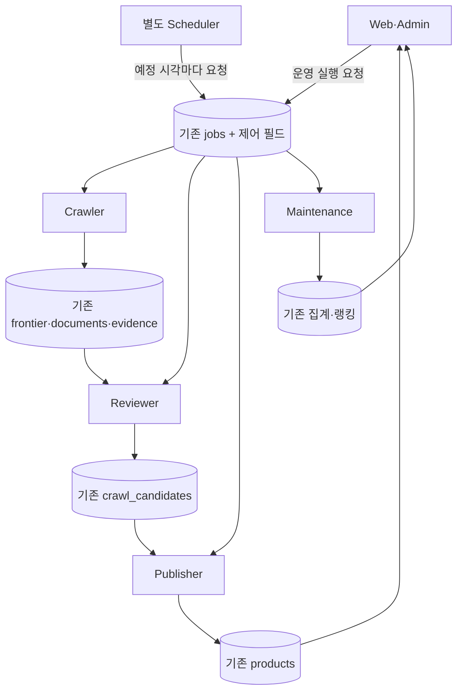

# 독립 상시 워커 — 기존 코드를 유지하는 단계적 리팩토링

개정: 2026-09-08 KST. 현재 코드와 재대조한 수정안이다. 이 문서가 앞선 범용 큐 중심 설계와
그 인수인계의 실행 순서를 대체한다. 이번 작업은 문서 수정과 기존 단위 테스트 확인까지다.

## 1. 결정과 범위

**기존 잡 함수와 PostgreSQL의 대기 상태를 유지하고 실행 프로세스부터 분리한다.**
새 범용 큐, 전체 후보 상태 교체, 공개 API 변경을 먼저 구현할 필요가 없다.

web/scheduler/crawler/reviewer/publisher/maintenance는 독립 프로세스로 배포하되 worker는
같은 이미지와 하나의 실행기에 역할 인자만 달리한다. 각 역할은 처음에는 한 프로세스·한 잡씩
실행한다. 별도 저장소나 서비스별 프레임워크를 만들지 않는다.

1. **A — 독립 운영:** 기존 수집·규칙 심사·발행을 웹 HTTP 밖으로 옮기고 결과·정책은 유지한다.
2. **B — AI 리뷰 추가:** 크롤링 후보에 한정해 독립 리뷰 워커의 추가 심사와 승인 근거를 붙인다.
3. **C — 병목 개선:** 사용자 증가 시험에서 드러난 조회·DB·수집 병목만 순서대로 개선한다.

A만 끝낸 것을 AI 리뷰 완료라고 보고하지 않는다. 사용자가 원한 자동 리뷰 흐름은 B까지 필요하다.
프로세스 분리는 물리 서버 분리와 다르다. 처음에는 같은 서버에 배치할 수 있다.

## 2. 이전 설명의 정정

| 이전 설명·계획 | 현재 코드에 따른 정정 |
|---|---|
| 영속 큐부터 새로 구축해야 한다 | frontier, 후보 state, evidence due 시각, jobs.cursor가 이미 대기열 역할을 한다. 기존 jobs에 실행 요청 제어만 추가한다. |
| 항목 잠금이 없다 | `dequeue()`는 SKIP LOCKED와 10분 회수를 이미 구현한다. 전체 runJob은 이름별 직렬화하므로 같은 역할 복제본 증가만으로 해당 잡 처리량이 늘지는 않는다. |
| 새 발행 트랜잭션이 필요하다 | `guardPublication()`과 `products.insert()`가 후보 published 전환과 제품 생성을 이미 한 트랜잭션으로 처리한다. 이를 유지한다. |
| 기존 guard가 AI 심사 당시 원본까지 보장한다 | 현재 guard는 발행 함수가 읽은 입력과 commit 직전 상태를 비교한다. 그보다 이른 AI 심사 입력과의 일치는 B에서 별도로 확인해야 한다. |
| 사용자 갱신이 모두 동기 방식이다 | `/api/products/[slug]/refresh`는 이미 queueMakerRefresh 후 202를 반환한다. 관리자 force와 등록/소유권 확인은 동기 외부 요청이다. |
| admin force를 queueMakerRefresh로 바로 치환하면 같다 | helper는 출처·미디어 선언의 due만 바꾼다. force:true는 최근 관측 미디어도 다시 수집하므로 추가 범위를 보존해야 한다. |
| 소유권 인증 후 공개는 P0 결함이다 | verified 전환은 현재 서비스 계약이다. 소유권/등재 분리는 정책 변경으로서 이번 필수 범위에서 제외한다. |
| 새 후보 state로 전면 교체한다 | new/approved/rejected/needs_review/published를 유지한다. AI 실행 이력과 발행 조건만 추가한다. |
| AI 근거 gate·24시간 freshness가 항상 적용된다 | enforceEligibility가 켜져야 근거 gate가 적용되고 guard의 24시간 검사는 scanId가 있는 분기다. 코드 기본 enforceEligibility는 false, 운영 DB 설정은 이번에 조회하지 않았다. |
| 원격 LLM API로 바꿔야 분리된다 | 현재 분류는 Claude CLI다. A에서는 분류·폴백·OG 수집을 Publisher로 그대로 이동한다. API 전환은 필수가 아니다. |
| 집계가 이미 watermark로 나뉘어 있다 | 현재 rollupClicks/refreshRankings는 전체 함수를 호출해 done=true를 반환한다. 실행 분리와 집계 분할은 별도다. |
| Redis·객체 저장소·조회 모델 이전을 함께 해야 한다 | 기존 저장·공개 API·랭킹을 유지한다. 반복 집계 등 확인된 비용부터 줄이고 나머지는 실측 후 선택한다. |

기준은 HEAD `a1f8cfb`와 현재 미커밋 홈·인증·compose 변경이다. 운영 DB 건수·자원·API 잔여량·
배포 상태는 측정하지 않았다. PENDING의 미배포 기록은 과거 시점이다. 아래 병목은 코드상
가능성이지 이번에 실제 운영 장애를 확인했다는 의미가 아니다.

## 3. 재사용할 코드

| 책임 | 유지할 코드·데이터 | 최소 변경 |
|---|---|---|
| 실행 | `lib/jobs/runner.ts`, `jobs` | runJob/JobContext/JobOutcome 유지, 실행 요청·소유권 제어 추가 |
| 작업 등록 | `lib/jobs/registry.ts` | 실행 handler와 이름·역할 메타데이터만 분리 |
| CLI | `scripts/run-job.ts`, `scripts/evidence-worker.ts` | 공통 실행기를 호출하는 호환 wrapper로 유지 |
| 탐색·수집 | `lib/crawl/jobs/seed.ts`, `fetch.ts`, `repository.ts`, `search-window.ts` | pendingPage/window/partial cursor와 frontier 선점 보존 |
| 규칙·사람 심사 | `jobs/judge.ts`, `rules.ts`, `review.ts`, `recordAutomaticJudgement()` | A는 유지, B는 같은 판정과 락 패턴 활용 |
| 발행 | `jobs/publish.ts`, `publish.ts`, `publication-guard.ts` | 기존 insert/중복 보호 유지, B에서 AI 승인 검사만 추가 |
| 근거 수집 | `lib/jobs/products/evidence-refresh.ts`, `agent-evidence-refresh.ts` | due 조회·partial 재개·collector cache·제품 세대 보호 유지 |
| 메이커 갱신 | `lib/domain/evidence/maker.ts`의 queueMakerRefresh | 기존 202와 시간당 1회 제한 유지 |
| 집계·운영 화면 | 기존 click-rollup/ranking-refresh/uptime와 `/admin/status` | 역할 배치와 상태 표시 보완 |
| 이미지 | `lib/domain/media/storage.ts`, `postgres-storage.ts` | DB 이미지 저장과 URL 유지 |

개발 AI 탐지기는 기존 catalog/parse/collect/summary와 agent_repository_scans/observations를
재사용한다. 새로운 provider별 탐지 시스템을 만들지 않는다.

## 4. A: 실행 경계만 먼저 분리



| 역할 | A에서 처리하는 기존 잡 |
|---|---|
| scheduler | handler를 실행하지 않고 due 잡 이름만 기록 |
| crawler | crawl-seed, crawl-fetch, product-evidence-refresh, agent-evidence-refresh, uptime-ping |
| reviewer | crawl-judge; B에서 crawl-agent-review 추가 |
| publisher | crawl-publish, 현재 CLI 분류·OG 처리 포함 |
| maintenance | click-rollup 성공 후 ranking-refresh |
| web | 공개·등록·verify·어드민 유지; cron과 어드민 수집 실행만 제거 |

공통 worker 실행기가 역할별 요청을 poll하고 기존 runJob을 호출한다. 역할마다 잡 하나씩,
crawler 안에서는 round-robin으로 순회한다. handler 내부 Promise.all 요청은 별도 한도로 센다.
한 역할의 느린 잡이 다른 역할을 막지 않는다. 등록·verify의 외부 요청까지 사라진다고 표현하지 않는다.

`app/admin/status/page.tsx`도 JOB_NAMES를 실행 registry에서 import한다. cron만 고치면 웹에
수집 모듈 참조가 남는다. 신규 `lib/jobs/catalog.ts`에 이름·역할·주기만 두고 status/cron은
이 파일을 읽는다. 기존 registry의 handler 연결은 worker/CLI에서 사용한다. 여섯 registry는 불필요하다.

### 기존 jobs에 필요한 작은 확장

새 work_items/schedules/outbox 테이블을 A의 선행 조건으로 만들지 않는다. jobs에
requestedVersion, processedVersion, nextScheduledAt, notBefore, leaseToken, workerSeenAt을 가산한다.
기존 cursor/lockedAt/lastRunAt/lastSuccessAt/lastError/runs를 보존한다. 시각은 DB 기준이다.
workerSeenAt은 유휴 poll에서도 갱신하는 관측용 필드로서 잠금이나 성공 시각으로 사용하지 않는다.
Scheduler 관측은 기존 heartbeat 잡 행을 활용하고 수집 역할의 heartbeat와 구분한다.

- Scheduler는 10초마다 due 행을 확인하고 실행 요청과 nextScheduledAt을 한 트랜잭션에서
  기록한다. pending 요청은 합치고 원래 예정 시각을 기준으로 다음 시각을 정한다. 다른
  scheduler가 이미 처리한 같은 예정 시각을 다시 요청하지 않도록 조건부 선점한다.
- 명시적 재실행은 requestedVersion을 증가시킨다. worker는 선점한 버전까지만 완료 표시한다.
  실행 도중 들어온 새 요청은 남는다. pending/backoff 중에도 다음 예정 시각을 전진시켜
  10초마다 신호가 계속 쌓이지 않게 한다.
- **요청 한 건은 기존 bounded tick 한 번**이다. done=false도 성공 tick이면 그 요청 버전은
  처리 표시하고 cursor는 보존한다. 다음 tick이 이어받는다. done=true일 때만 cursor를 비운다.
  예외 때는 cursor/요청을 남기고 notBefore 이후 재시도한다. done의 의미를 큐 배출 여부로 바꾸지 않는다.
- 상태 표의 성공은 tick 성공이지 모든 후보 처리 완료가 아니다. 요청을 위해 jobs 행이 미리
  생겨도 lastRunAt=null이면 미실행이다. 현재 ‘행이 없으면 미실행’ 설명과 관련 테스트를 수정한다.

### 잠금과 복구의 현실적인 범위

선점마다 leaseToken을 발급하고 save/heartbeat/release는 이름+token 조건으로 갱신한다.
lockedAt을 15초마다 갱신하고 A의 stale 회수 기준은 기존 10분으로 유지한다. 갱신 실패 시
hasBudget을 false로 만들고 새 외부 요청을 중지한다. 정상 종료 시 현재 tick을 끝내고 해제한다.

**runner의 token 검사만으로 모든 도메인 쓰기가 보호되지는 않는다.** frontier의
putDocument/markFrontier는 현재 token을 모른다. 따라서 A에서는 같은 역할의 활성 복제본을
겹쳐 실행하지 않고 stop/drain 후 교체한다. 응답 없는 프로세스는 supervisor로 종료한 뒤
대체하거나 만료 후 복구한다. Publisher의 기존 트랜잭션 guard는 유지한다. B의 장시간 AI와
확장 단계에서는 결과 저장·발행 트랜잭션에도 유효 소유권 검사를 추가해야 한다.

25초 hasBudget은 강제 timeout이 아니다. HTTP 자체 timeout, CLI 자식 종료와 watchdog을
검증한다. 종료 확인 없이 잠금을 조기 해제하지 않는다. 자동 종료가 확인되지 않으면 기존
10분 임대 뒤 복구될 수 있어 ‘모든 장애 2분 복구’를 A의 보장으로 사용하지 않는다.

### 주기와 집계 순서

처음에는 현재 의도 주기인 fetch/evidence 1분, judge/publish 5분, seed 15분, uptime tick
10분, click-rollup/ranking 1시간을 유지한다. source별 nextAttemptAt·제품별 확인 간격은 그대로다.
처리 속도가 필요하면 그때 주기만 조정한다. 쉘의 ‘모든 작업 종료 후 60초 sleep’은 제거한다.

click-rollup의 성공 완료 기록과 ranking-refresh 실행 요청만 같은 트랜잭션으로 연결한다.
실패/부분 완료 시 랭킹을 요청하지 않으며 성공 직후 죽어도 요청이 남는다. 이 한 의존성에
범용 DAG 엔진은 필요 없다. 집계 분할은 C에서 따로 한다. Scheduler가 죽어도 요청된 tick은
처리할 수 있지만 새로운 정기 tick은 생기지 않는다. 무한히 진행한다고 표현하지 않는다.

## 5. 어드민 force 갱신은 기존 의미까지 보존

메이커 202 경로는 그대로 둔다. 어드민은 권한 확인 뒤 예약만 기록하도록 변경하며,
queueMakerRefresh의 공통 due 갱신 부분은 추출하되 maker/admin 감사 action을 구분한다.

force:true는 최근 관측 미디어도 포함하므로 단순 due 변경으로 기능을 줄이지 않는다.
이 경로만 `product_refresh_requests`를 추가한다. 제품 ID당 한 행에 요청/완료 버전,
시각·actor·force, 실행 중 제품 세대·완료 source key/cursor·결과·오류를 저장한다.
일반 frontier/evidence를 이 표로 이관하지 않는다.

기존 product-evidence-refresh 잡이 주기 갱신과 강제 요청을 함께 처리한다. 완료 출처·미디어를
진행점에 남겨 budget 종료 뒤 처음부터 강제 수집을 반복하지 않는다. 현재 수집/정규화/이미지
저장 함수에 필요한 진행점 인자만 추가한다. 요청 버전과 제품 세대로 실행 중 재요청·삭제/
재등록을 보호한다. force도 API 재시도 시각을 우회하지 않으며 기존 정상 facts를 보존한다.
완료 source key에는 선언 revision/URL도 포함해 실행 중 출처가 바뀌면 새 대상을 처리한다.
현재 helper의 제품 세대 보호와 선언 revision 비교를 그대로 활용한다.

관리자 버튼은 ‘예약됨/진행/결과’를 표시한다. 즉시 성공 건수를 보여주던 부분만 변경한다.
수집 중 새 due 요청을 받은 뒤 완료 저장이 미래 시각으로 덮는 경합은 요청 버전으로 재처리한다.
공개 등록·verify·편집 토큰 API에는 영향이 없다.

## 6. B: 기존 후보 상태에 AI 리뷰 추가

새 `crawl-agent-review` 잡, `lib/crawl/agent-review.ts`, `lib/crawl/jobs/agent-review.ts`,
`crawl_review_attempts`를 추가한다. A의 reviewer는 기존 규칙 심사이고 B부터 AI 리뷰가 포함된다.
운영 전환에는 별도 reviewMode(off/observe/enforce, 기본 off)를 crawl settings에 추가한다.
이는 기존 agentEvidence.enforceEligibility와 다른 설정이며 그 근거 정책을 대체하지 않는다.

대상은 **자동 approved 후보와 자동 needs_review 중 재검토 가능한 후보**다. 명백한 규칙 탈락은
LLM을 부르지 않는다. 현재 규칙·관측 근거를 먼저 검사하고 의미 판단만 AI에 맡긴다. 관리자
결정은 자동 리뷰가 덮지 않는다. AI timeout은 후보 탈락/승인 대신 실행 이력의 재시도로 남긴다.

추가 테이블에는 후보 ID, 실제 심사 입력의 bounded snapshot/hash, 룰·detector·prompt 버전,
scan ID/SHA, 사용 근거, provider/model, 결과·사유·비용·시각·재시도 시각을 둔다.
**전체 원본을 새 버전 저장소로 이관하지 않고 심사한 입력만 복사한다.** 이름/설명/URL/관계/
근거/판정 설정을 hash에 포함하고 동일 입력의 성공 결과를 재사용한다. 활성 실행과 유효 승인은
중복되지 않게 하며 재시도 이력을 따로 남긴다. 끝난 감사 기록을 나중 결과로 덮지 않는다.

recordAutomaticJudgement는 현재 new 후보만 갱신한다. needs_review/approved에 그대로
재호출하면 적용되지 않는다. 그 락·스냅샷 패턴을 재사용하는 작은 recordAgentReview를 추가해
이력과 후보 전환을 같은 트랜잭션에서 처리한다. 입력 변경·관리자 결정·실행 소유권 상실이면
자동 결과를 폐기한다. candidate.decidedBy는 auto를 유지하고 AI 출처는 review 이력에서 구분한다.

### 발행 조건과 UI

B의 리뷰 gate를 켜면 자동 approved도 현재 입력에 맞는 승인 이력이 있어야 발행된다.
기존 listCandidates의 **LIMIT 전에 리뷰 조건을 적용**해 대기 후보 10개가 발행을 막지 않게 한다.
대기 후보를 publish 실패 처리에 넣어 rejected/needs_review로 뒤집지 않는다.
기존 guardPublication 트랜잭션 안에서 승인/hash/소유권을 다시 확인한다.

어드민 상태 표에는 자동 리뷰 대기/사람 확인만 보완한다. 관리자 승인 예외는 현행 정책으로
남기되 actor·사유를 기록한다. 기존 AI 근거·설명 예외를 일괄 폐지하지 않는다. 현재 차단 URL,
중복과 입력 변경 보호는 유지한다.

agent-evidence-refresh는 일부 ai_evidence_pending 후보를 이미 new로 되돌린다. 이 연결을
재사용한다. 다른 이유도 모두 자동 재심사된다고 가정하지 않는다. 추가 근거 요청은 원본 변경·
간격·최대 2회 조건을 두고 필요한 이유만 대상으로 한다. 문서만 갱신하고 candidate를 그대로
두면 documentsAwaitingJudgement가 다시 선택하지 않는 점을 처리하며 관리자 결정을 보호한다.

### AI 의미와 기존 분류 보존

파일 발견·선택 모델 설정·기여 표기·실제 실행 증명을 구분한다. 기존 executionVerified=false와
확인된 내용만 보여주는 정책을 유지한다. AI 기능 제품과 AI로 개발한 제품을 새 등재 정책으로
합치지 않는다. 승인 기준 변경은 별도다.

classifyCategory의 CLI 15초 제한과 키워드 폴백은 재사용한다. B에서 심사와 카테고리를 함께
저장해 중복 호출을 줄일 수 있지만 Publisher의 CLI/OG 완전 제거는 A의 선행 조건이 아니다.
A부터 Publisher의 외부 통신을 막으면 현행 분류·이미지가 깨진다.

심사 연결은 기존 CLI의 도구 없는 구조화 호출 패턴을 활용할 수 있다. 카테고리 전용 함수를
심사기로 오해하지 않고 새 prompt/validator를 추가한다. 원격 API 전환과 다중 provider 추상화는
필수가 아니다. 심사 호출은 초기 1개, 같은 입력의 시도는 최대 3회다. 시간·토큰·호출 예산과
자식 프로세스 종료를 설정한다. 외부 지침 파일을 명령으로 실행하지 않고 근거 ID를 실제 입력과 대조한다.
시도 한도를 넘으면 자동 재시도를 멈추고 어드민에 사람 확인 대상으로 표시한다. 실제 부적격으로
오인해 rejected 처리하지 않는다. 새 원본이나 명시적 재심사 요청이 있어야 다시 심사한다.

## 7. C: 작은 부하 개선부터 적용

| 순서 | 현재 코드의 비용 | 우선 개선 | 큰 변경의 조건 |
|---|---|---|---|
| A와 함께 | 프로세스마다 DB pool 10 | 기존 DB 초기화의 역할별 pool·유한 대기 | 실제 연결 대기와 전체 합계가 한계에 접근 |
| A와 함께 | 여러 수집 잡의 공유 GitHub 한도 | crawler 한 개·잡 순차, 공통 client에 공유 제한·대기 | 반복 rate limit 또는 수집 처리량 부족 |
| C1 | 홈 getHomePulse의 5개 쿼리 | 같은 기간 결과의 짧은 TTL과 동시 재계산 통합 | 캐시 뒤에도 집계가 웹 목표를 방해 |
| C1 | 매 방문 collection 시작 행 upsert | 최초 NULL→시각만 원자적으로 기록 | 클릭 쓰기 부하가 실측 병목일 때 추가 분리 |
| C2 | 일부 인기 정렬·목록 원천 클릭 조회 | 기존 ranking_entries/daily 활용 가능한 경로와 batch 쿼리 개선 | 느린 해당 지표에만 조회 스냅샷 추가 |
| C2 | 전체 rollup·원천 DELETE | 시간·락·WAL 측정 후 해당 함수만 배치화 | 전체 호출이 실제 문제일 때 |
| C2 | 등록·verify 외부 HTTP | 현행 응답·SSRF·timeout·요청 제한 유지, 프록시 점검 | 긴 요청이 서버 한도를 점유하면 별도 API 이전 |
| C3 | PostgreSQL bytea 이미지 | 캐시 헤더·크기·I/O·백업 관측 | 병목일 때 MediaStorage 구현만 교체 |

홈은 force-dynamic이므로 public 캐시 헤더만 덮어쓰지 않는다. 설치된 Next 16.3.1 문서가
unstable_cache를 use cache로 대체하는 방향을 안내하더라도 전체 앱의 Cache Components
전환을 이번에 끼워 넣지 않는다. 단일 web에서는 순수 공개 집계의 유한 TTL·한 번의 동시 재계산
부터 적용할 수 있다. 초기 TTL 예시는 60초다. 필터별 무제한 Map을 만들지 않으며 관리자 변경 뒤
집계 갱신 지연은 as-of/TTL 범위를 지킨다. 상세·권한·차단 데이터 전체 stale 제공은 별도 검증 사항이다.

일별 고유 수를 더해 기간 고유 방문자를 계산하지 않는다. KST 경계·랭킹 정책·원천 보관 기간은
유지한다. 새 조회 테이블, Redis, 전역 캐시 outbox, 클릭 스트림, 전체 페이지네이션 재작성은
측정 후 선택한다. 사용자 증가 대비를 이유로 공개 기능 전체를 바꾸지 않는다.

## 8. 상시 운영과 자원 한도

기존 GitHub 조건부 요청·body cap·timeout·partial cursor를 유지한다. agent scan의 조각당
12요청/20초·파일32개·파일당64KiB·총512KiB도 보존한다. githubRequest를 공유 제한 진입점으로
보강해 credential/resource의 reset/Retry-After를 다른 잡도 준수하게 한다. 기존 seed/agent의
cursor 대기 처리는 남기고, fetch의 reset 로그만 남기는 부분을 실제 재시도 시각에 반영한다.
모든 source의 backoff를 새로운 공통 정책으로 일괄 교체하지 않는다.

메이커 갱신의 시간당 1회·신뢰 IP 제한은 이미 있으므로 재구현하지 않는다. 어드민 요청도 한도와
중복 통합을 적용한다. 운영 hop 수는 실제 프록시 구성에 맞춰 등록/verify의 direct 버킷 공유를 방지한다.

적체 판단에는 기존 frontier/candidate 카운트를 쓴다. 초기 예시는 대기 10,000건에서 seed 양보,
5,000건 아래 재개다. 이는 조정값이며 절대 행 상한이나 모든 탐색 누락 복구 보장이 아니다.
seed의 pendingPage/itemIndex를 넘기기 전에 양보해 현재 진행점을 보존한다. 장기 중지 시
검색 기간의 빈틈은 기존 search-window/incomplete 기록으로 확인한다. 새 자동 제어 플랫폼을 만들지 않는다.

CPU/DB 대기·최장 큐 대기를 보고 먼저 탐색·재수집을 감속한다. 같은 role의 자동 수평 확장은
A에서 사용하지 않는다. 증설 전에 해당 단계의 항목 선점과 결과 쓰기 보호를 완성해야 한다.

### 배포 경계

- 기존 Dockerfile에 공통 worker target을 추가한다. 같은 소스·lockfile·이미지에 역할 인자만 다르게 준다.
- worker에는 실제 lib/scripts/tsconfig가 필요하다. tsx는 현재 devDependency이므로 standalone
  출력만 복사해 실행된다고 가정하지 않는다. A는 tsx를 명시적 런타임 의존성으로 관리해 현재 TS/alias를 활용한다.
- CLI는 A의 publisher와 B의 reviewer에 필요하다. 웹의 registry/force 실행 참조를 제거한 뒤에만
  웹 이미지에서 CLI를 뺀다. 새 bundler나 저장소 재배치는 선행 조건이 아니다.
- 기동 의존성은 DB/migration에 두고 웹 HTTP를 기다리지 않는다. 기존 migrate.mjs를 1회 release
  단계로 사용하여 모든 worker가 동시에 마이그레이션하지 않게 한다. 로컬 compose와 운영 설정을 구분한다.
- 서비스별 restart:unless-stopped, CPU/RAM 상한, 비루트, 로그 회전, 역할별 비밀값을 적용한다.
  plain Compose의 unhealthy 표시는 자동 재시작 명령이 아니므로 hang 감시·종료를 검증한다.
- SIGTERM 때 새 잡을 받지 않고 현재 tick을 마친 뒤 DB pool을 닫는다. 진행 불능은 종료한다.
  외부 API 장애·비활성 설정·유휴 상태를 프로세스 장애와 구분한다.
- heartbeat와 최근 실제 처리를 현재 status 화면에 추가한다. 어드민 탭이나 브라우저 타이머에 의존하지 않는다.

### 사양은 실측 전 예산 가정

8 vCPU/16GB를 필수 최소 사양으로 단정하지 않는다. 기존 서버 여유부터 확인한다. 전체 동거형의
여유 있는 시험 예시는 8 vCPU/16GB, DB 별도 worker 호스트는 4 vCPU/8GB부터 시험할 수 있다.
CLI RSS가 필요하며 대량 브라우저·로컬 LLM 추론은 포함하지 않는다.

메모리 상한 예: web 1.5GiB, crawler 1.5GiB, reviewer 2GiB, publisher 1.5GiB(CLI 포함),
maintenance 1GiB, scheduler 256MiB로 앱 합계 7.75GiB. DB 4GiB와 OS/파일 캐시 여유를 더해
16GiB 호스트에서 시험한다. peak 측정 뒤 제한·배치를 조정한다. 빌드는 운영 부하와 분리한다.

DB pool 예: web8+crawler4+reviewer3+publisher3+maintenance3+scheduler2=23개.
web 2개면 31개이며 배포·관리·다른 앱의 연결은 별도다. 모든 역할을 동시에 두 배로 띄우지 않는다.
웹 지연이 수집 부하와 함께 나빠지면 worker 호스트부터 분리한다. 호스트 장애 대응에는 DB
standby와 복수 호스트가 추가로 필요하다. 24시간 상주를 무중단 보장이라고 표현하지 않는다.

## 9. 변경 묶음과 제외 범위

| 단계 | 파일·스키마 범위 | 완료 기준 |
|---|---|---|
| A1 | 신규 lib/jobs/control.ts, catalog.ts; 기존 runner/registry/schema 확장 | 요청 유실·오래된 release 방지, 기존 cursor/done 보존 |
| A2 | 신규 scripts/worker.ts, scheduler.ts; 기존 CLI/cron/status/Dockerfile/package/compose | Web 중지 상태에서 기존 잡 실행, worker 이미지의 실제 CLI 확인 |
| A3 | 기존 maker/refresh 재사용, product_refresh_requests, 관리자 버튼 | 최근 미디어까지 force 의미 보존, 부분 재개와 실행 중 재요청 처리 |
| B | 신규 agent-review 모듈·잡·crawl_review_attempts; 기존 후보 조회/발행 guard/UI 일부 | 자동 크롤링 발행의 유효 리뷰 승인, 기존 제품·관리자 결정 보존 |
| C1 | DB pool·홈 집계 재사용·collection 초기화·기존 rate limit | 기존 결과를 유지하며 비용 감소 확인 |
| C2 이후 | 측정에서 문제가 된 집계·조회·미디어만 | 같은 조건의 변경 전후 실측 |

A/B의 새 도메인 테이블은 **강제 갱신 요청 1개 + AI 심사 기록 1개**로 한정한다.
기존 jobs/frontier/documents/candidates/products를 새 큐로 이관하지 않는다. control은 잡 실행
신호만 다루며 범용 payload workflow나 임의 agent orchestration을 받지 않는다.

이번 필수 범위에서 제외: products.status 분리, 소유권/등재 정책 변경, 등록/verify 일괄 202,
전체 immutable document 저장소, Redis/BullMQ, 범용 outbox/DAG, 전체 조회 모델 재작성,
일괄 객체 저장소 이전, 다중 provider 프레임워크, 모든 worker의 즉시 수평 확장.

## 10. 이전·롤백

1. 가산 마이그레이션과 호환 코드부터 준비한다. 기존 행·상태·cursor를 비우거나 대량 재수집하지 않는다.
2. 기존 HTTP scheduler/evidence-worker/수동 CLI 실행 주체를 확인해 중지·drain한다.
   신·구 worker가 서로 다른 락으로 동시에 소비하지 않는다.
3. 역할별 새 worker를 하나씩 켜고 기존 진행점에서 재개한다. cron은 인증·허용 이름 검사 뒤
   control에 실행 요청만 기록한다. 내부 cron 응답 기대값만 조정하고 공개 제품 API는 유지한다.
4. A의 결과가 동등하면 B를 관측 모드로 추가한다. 표본 확인 후 크롤러 전용 리뷰 gate를 켠다.
   이를 켜기 전에는 AI 이력이 자동 발행을 제어하지 않는다는 상태를 명시한다.
5. gate 전환 시 미발행 approved도 심사한다. 기존 published/claimed를 숨기거나 과거 AI 승인을 꾸며 넣지 않는다.
6. B 장애 시 새 자동 발행을 보류한다. AI를 끄는 것으로 gate를 조용히 우회하지 않는다.
   기존 정책으로 복귀하려면 명시적인 운영 결정이 필요하다.
7. A 롤백도 새 실행 주체를 먼저 중지하고 호환 release를 사용한다. 남은 force 요청을 처리/보존한다.
   과거 이미지는 새 요청/version을 모르므로 그대로 병행하지 않고 새 컬럼/테이블도 즉시 DROP하지 않는다.

## 11. 검증 결과와 구현 후 확인할 것

이번에 실행한 기존 단위 테스트:

```sh
npm test -- tests/evidence-worker.test.ts tests/evidence-scheduler.test.ts tests/agent-evidence-refresh-demand.test.ts tests/crawl-publication-guard.test.ts tests/crawl-publish-evidence.test.ts tests/crawl-agent-input.test.ts tests/agent-evidence-summary.test.ts
```

**7개 파일, 25개 테스트 통과.** 기존 worker 종료·첫 evidence 스케줄·partial 우선 처리·
출처 관계·정적 근거 의미·발행 근거와 snapshot 보호를 확인했다. 외부 HTTP/LLM은 mock이다.
DB 트랜잭션·새 worker·운영 성능을 검증한 결과는 아니다. 향후 Vite native config loader 호환
경고가 있었지만 테스트는 성공했고 이번 범위에서 설정을 바꾸지 않았다.

| 단계 | 기존 시험 재사용 | 추가 검증 |
|---|---|---|
| A1 | tests/integration/job-runner.test.ts | 실행 중 추가 요청, token 불일치 save/release, done=false 의미, cursor 재개 |
| A2 | evidence-worker/evidence-scheduler, tests/integration/crawl-pipeline.test.ts | Web 30분 중지, scheduler 중복, 역할별 재기동, CLI 이미지 |
| A3 | tests/integration/evidence-refresh.test.ts와 maker route 시험 | 재요청, 최근 관측 미디어 force, partial 재개, 삭제/재등록 |
| B | 기존 crawl/agent-evidence/publish/review 시험 | 오래된 승인 거부, needs_review CAS, LIMIT 앞 대기 후보, AI 실패·관리자 결정 보존 |
| C | 기존 home/metrics/ranking 시험 | 같은 기간 지표 일치, 쿼리·락·지연·RSS 전후 비교 |

통합 시험은 tests/integration/env.ts·setup의 TEST_DATABASE_URL을 확인한 전용 DB에서만
실행한다. 현재 setup은 테이블을 비우므로 운영/개발 수집 DB에 실행하지 않는다. 명령 예시는
`npm run test:integration -- tests/integration/job-runner.test.ts`다. 빌드·E2E는 실제 실행 경계/
화면이 변경된 단계에서 수행한다. 이번 문서 작업에서는 통합 시험·빌드·E2E를 실행하지 않았다.

최종 운영 승인에는 실제 후보 10개 판정 비교와 24시간 연속 운영이 필요하다. 통제된 provider로
10→50→100 RPS를 올려 cache 유무·데이터 수·p95·CPU/RSS·pool 대기·허용 요청과 429를
구분해 기록한다. GitHub에 부하 시험을 하지 않는다. 이전 100/300 RPS·p95 수치는 실측 용량이
아니며 전면 재구축의 근거로 쓰지 않는다. 문서 수정만으로 무과부하나 복구를 입증하지 않는다.

## 12. 확인한 근거

현재 저장소와 설치된 Next 문서를 우선했다. 특히 runner/registry, scheduler/evidence-worker,
crawl repository/judge/publish/publication-guard, maker/refresh, admin status/force 및
메이커 refresh API를 대조했다.

프레임워크 문서:
`node_modules/next/dist/docs/01-app/02-guides/self-hosting.md`,
`node_modules/next/dist/docs/01-app/03-api-reference/04-functions/unstable_cache.md`.

앞선 검토에서 확인한 공식 자료: [PostgreSQL 17 SELECT](https://www.postgresql.org/docs/17/sql-select.html),
[GitHub API rate limits](https://docs.github.com/en/rest/using-the-rest-api/rate-limits-for-the-rest-api),
[Docker restart policies](https://docs.docker.com/engine/containers/start-containers-automatically/).
