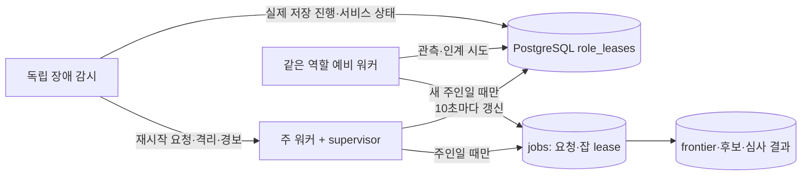

# 수집·심사 워커 자동 복구와 예비 워커 인계 설계

작성일: 2026-09-28. 이 문서는 목표 설계와 단계별 구현 검증을 기록한다. P0는 PR #213의 필수 CI 통과 뒤 운영 8개 앱에 배포했다. P1 수집 선점 조기 회수와 역할 후보/lease/fencing은 전용 DB·실제 로컬 프로세스에서 검증했지만 운영 명령·예비 서비스는 아직 바꾸지 않았다. 아래의 `control_action`, 독립 감시 서비스, 자동 데이터 정체 재시작, `role_recovery_events`는 목표 설계이며 미구현이다.

## 목표와 범위

`crawler` 또는 `reviewer` 프로세스가 종료·정지·반복 실패하면 먼저 현재 서비스의 재시작으로 복구한다. 복구되지 않으면 같은 역할의 예비 워커가 자동으로 작업을 인계한다. 핵심 성공 신호는 프로세스가 `healthy`인 사실이 아니라 새 원본·규칙 판정·AI 심사 결과가 DB에 지속적으로 저장되는 것이다. 기존 요청, 커서, 심사 이력, 재시도 시각, 발행 승인 조건을 보존한다.

1차 적용 대상은 `crawler`, `reviewer`다. `scheduler`는 두 역할의 새 정기 요청을 만드는 의존성이므로 같은 감지·재시작 경로를 적용한다. 안정화 뒤 `publisher`, `text`, `maintenance`로 넓힌다. 서버와 DB의 streaming 구성 변경은 이 설계의 범위가 아니다. 사용자가 중단한 `product-intro-check`는 복구 과정에서도 재개하지 않는다.

## 확인한 현재 동작

- 운영 Docker Swarm의 crawler·reviewer·publisher·text·maintenance·scheduler는 각각 `replicas=1`, `restart=any`, 재시작 지연 5초다. 2026-09-28 읽기 전용 `docker service inspect`로 확인했다. 그때 여섯 서비스의 실행 중 컨테이너는 모두 healthy였다. 장애 주입으로 재시작 시간을 실측하지는 않았다.
- [`worker-supervisor.ts`](../../../scripts/worker-supervisor.ts)는 자식 IPC 30초, 잡 밖 진행 90초, crawler/reviewer 잡 180초를 감시하고 비정상 종료한다. Swarm이 다음 프로세스를 시작한다. Docker healthcheck의 unhealthy 표시만으로 자동 재시작되지는 않는다.
- [`worker.ts`](../../../scripts/worker.ts)는 역할에 속한 잡을 한 프로세스에서 순차 소비한다. 역할별 2개 복제본을 바로 실행하면 *서로 다른 잡*은 동시에 실행될 수 있어 현행 외부 호출량·순서 전제가 달라진다.
- [`runner.ts`](../../../lib/jobs/runner.ts)는 잡별 lease를 15초마다 갱신하고, [`lease.ts`](../../../lib/jobs/lease.ts)의 90초 stale 기준으로 회수한다. 이는 잡 소유권이지 역할의 주인 선출은 아니다.
- crawler가 `fetching`으로 선점한 개별 frontier 행은 [`repository.ts`](../../../lib/crawl/repository.ts)의 `next_attempt_at`에 따라 현재 10분 뒤 다시 선택될 수 있다. 잡 lease가 90초에 회수돼도 그 항목은 별도로 기다릴 수 있다.
- 1차 AI 심사의 이전 `running` 시도는 새 소유자가 `owner_changed`로 supersede한다. 현재 [`agent-review-repository.ts`](../../../lib/crawl/agent-review-repository.ts)는 superseded 시도도 모델 시도 한도에 포함한다. 반복 프로세스 장애가 후보의 재시도 한도를 소진할 수 있다.
- 운영 화면은 단계별 준비된 대기량과 최근 1·5분의 **저장된 결과**를 계산한다. [`throughput-model.ts`](../../../lib/operations/throughput-model.ts)의 stalled 표시는 화면용이며 자동 인계 명령은 아니다.
- scheduler는 모든 정기 잡의 DB 요청을 만드는 공통 의존성이다. [`requestDueJobs`](../../../lib/jobs/control.ts)는 요청을 합치고 예약 시각을 원자적으로 전진시킨다. 기존 통합 테스트에서 두 scheduler poll을 동시에 실행해 요청 버전이 한 번만 증가함을 확인했다. 따라서 역할 워커의 소유권 장치와 별개로 scheduler 복제본부터 배치 검증할 수 있다.

### 2026-09-28 실제 검증

- 로컬 단위 4파일 23테스트, 전용 PostgreSQL 통합 5파일 70테스트 통과. 기존 테스트는 supervisor 판정, 잡 lease·커서·동시 scheduler 요청, 수집의 늦은 쓰기 거부, 심사 기록, 저장 처리량을 검증한다. 운영 Swarm 재시작 시간과 예비 인계는 검증하지 않는다.
- 전용 DB의 일회성 표적 재현 2테스트 통과(시험 파일은 실행 후 삭제). 동일 후보의 `running` 심사에 결과 없이 소유권을 세 번 바꾸자 세 기록이 모두 `owner_changed`로 끝났고 네 번째 claim은 `attempts_exhausted`였다. 현재 설정 모델과 일치시키면 준비 큐에서도 빠졌다. 개별 수집 항목은 선점 후 9분에는 재선택되지 않았고 10분 경과 후에야 attempts 2로 회수됐다.
- 첫 표적 시험은 시험 데이터의 모델 설정이 현재 심사 모델과 달랐고, 앱 시계를 DB 시각 대신 써 두 검증이 실패했다. 설정 모델과 DB의 `next_attempt_at`을 기준으로 교정한 뒤 2테스트 모두 통과했다. 이 실패는 운영 코드의 새로운 결함으로 계산하지 않는다.
- 09:08:35 UTC 운영 DB 읽기 전용 표본: 최근 1시간 발견155·원본159·규칙159·1차 AI38·2차 AI30·발행11건 저장. 원본·규칙의 최근 5분 결과가 0이어도 준비 큐가 각각 0이므로 장애로 판정하면 오탐이다. 전체 `needs_review` 2399건과 실제 1차 AI 준비 큐 0건도 구별해야 한다. 운영 장애 주입은 하지 않았다.

## 선택지

| 방식 | 장점 | 한계 |
|---|---|---|
| 현재의 Swarm 재시작만 사용 | 추가 소유권 장치가 필요 없다 | 반복 재시작·컨테이너 정지·정상 종료 후 결과 0건을 복구하지 못한다 |
| 역할별 복제본 2개를 모두 실행 | 한 프로세스가 죽으면 다른 프로세스가 잡 lease 만료 뒤 소비한다 | 서로 다른 잡이 동시에 돌아 API 쿼터·모델 호출량·역할 내 순차 실행 전제가 달라진다 |
| **역할별 활성 1개 + 상시 대기 1개** | 재시작 우선 정책과 현재 순차 실행을 유지한다 | 역할 lease, 쓰기 차단, 장애 판정, 예비 워커 검증이 필요하다 |

세 번째 방식을 채택한다. 예비 워커는 같은 역할의 별도 서비스로 항상 떠 있지만, 역할 lease를 얻기 전에는 잡을 소비하거나 외부 API를 호출하지 않는다. 예비 실행 위치는 기존 서버 이중화 배치 안에서 정한다. 활성 시 crawler 최대 1.5 GiB, reviewer 최대 2 GiB와 DB pool을 감당하는지 먼저 측정한다. 웹 컨테이너에 워커 자격 정보를 넣지 않는다.

## 구성과 소유권

구현된 `role_leases` 행은 역할마다 `owner_instance_id`, `owner_boot_id`, `owner_kind`, `owner_release`, `epoch`, `lease_until`, 최근 주 후보 부팅 JSON, `quarantine_until`, `updated_at`을 가진다. 목표 설계의 `preferred_instance_id`, `desired_release`, `control_generation`, `control_action`, `control_requested_at`과 `role_recovery_events`는 아직 추가하지 않았다. 역할별 활성/예비 서비스는 서로 다른 `SERVICE_INSTANCE_ID`를 사용하고 부팅마다 새 UUID를 만든다. 현재 격리는 5분 안의 주 후보 lease 획득 3회를 기준으로 한다.

DB 서버 시계로만 lease 만료를 판단한다. 주인은 10초마다 갱신하고 lease 유효 기간은 45초다. 예비 워커는 5초마다 확인한다. 획득과 `epoch` 증가는 단일 행의 원자적 조건부 갱신으로 처리한다. 주인이 바뀌면 epoch가 증가하며 이전 주인은 즉시 작업 시작을 중단하고 현재 호출을 취소한다. DB 연결이 끊겨 갱신 결과를 알 수 없을 때도 스스로 실행을 중단한다. 예비 워커가 여러 개여도 한 행 갱신의 승자만 활성화된다.

구현된 역할 후보 루프는 기존 `worker-supervisor.ts`의 바깥에서 5초마다 role lease를 확인한다. 활성일 때만 supervisor 자식을 띄우고 획득한 epoch를 전달한다. 10초 갱신 실패는 자식을 drain한다. 자식이 비정상 종료하면 후보 프로세스도 종료해 Swarm의 기존 `restart=any`가 첫 복구를 담당한다. 격리된 주 워커는 후보 루프에서 대기한다. 활성·대기 양쪽 후보가 15초마다 자기 `SERVICE_INSTANCE_ID`, boot UUID, release, 역할, 활성/대기 상태를 관측에 남긴다. 로컬 healthcheck는 대기 후보도 판별한다. 자식 IPC에 따른 갱신 중단과 관리자 화면의 두 후보/epoch 표시는 아직 후속 작업이다.

독립 감시 서비스는 DB의 구조화된 상태만으로 결정을 내린다. Swarm task 상태는 읽을 수 있을 때 진단 자료로 붙이며 Docker socket이나 Dokploy 배포 권한을 감시 서비스에 주지 않는다. 저장 진행 정체를 확정하면 `control_generation`을 하나 올리고 `control_action=restart`를 조건부 기록한다. 활성 후보 루프는 새 세대를 보면 자식에 SIGTERM을 보내 45초 drain을 기다린 뒤 비정상 종료하여 Swarm이 재시작하게 한다. 자식·후보 루프가 응답하지 않으면 role lease가 만료된다. 재시작 뒤에도 같은 정체가 확인되거나 비정상 부팅 한도에 이르면 감시 서비스가 한 트랜잭션에서 주 워커 격리 시각을 기록하고 `owner_instance_id`·`owner_boot_id`를 비우고 `lease_until=now()`로 만들며 epoch를 증가시켜 기존 소유권을 철회한다. 오래된 프로세스의 쓰기는 아래 fencing 검사를 통과하지 못한다. 감시 서비스가 죽어도 supervisor와 lease 만료에 따른 단순 장애 인계는 동작하며, 정체 자동 판정만 멈추므로 감시 서비스 자체를 별도로 관측한다.

잡 claim은 현재 역할 epoch와 유효한 role lease가 있을 때만 허용한다. 결과를 쓰는 트랜잭션도 같은 epoch와 기존 잡 token을 검증한다. 인계 트랜잭션은 역할 행만 바꾸고 다른 잡·제품 행을 잠그지 않는다. 기존 핸들러의 잠금 순서를 뒤집지 않기 위해서다. 예전 주인의 아직 유효한 잡 lease는 수동 삭제하지 않고 최대 90초 만료를 기다린다. 그 사이 예비 워커는 다른 준비된 잡을 처리한다. 외부 API 호출이 이미 나갔다면 비용이 중복될 수 있지만, 오래된 응답은 DB에 반영되지 않아야 한다.

이 쓰기 차단은 `ctx.save`와 `assertJobLease`에만 추가해서 끝나지 않는다. crawler의 frontier enqueue·상태 변경·원본 저장·규칙 판정, reviewer의 심사 claim·결과·2차 심사·감사 결과, 이후 발행 경로까지 **모든 변경 트랜잭션**을 감사해 role epoch 또는 소유권 토큰을 검증해야 한다. 특히 현재 `crawl-judge`의 `recordAutomaticJudgement`는 잡 lease를 인자로 받지 않으므로 변경 대상이다. 외부 호출 완료 후 기록하는 경로부터 검증한다. 이 감사와 통합 시험 전에는 예비 워커의 자동 인계를 켜지 않는다.

## 복구 상태 기계

| 상태 | 진입 조건 | 동작 | 다음 상태 |
|---|---|---|---|
| 정상 | 주 워커가 role lease를 갱신하고 저장 진행/정상 유휴가 확인됨 | 주 워커만 잡 소비, 예비는 관측 | 정상 또는 재시작 관찰 |
| 재시작 관찰 | 프로세스 종료, supervisor 강제 종료, 컨테이너 비정상 또는 수요가 있는데 저장 진행 정지 | 현행 Swarm 재시작을 우선 허용. 실행 중 작업의 lease·커서는 보존 | 정상 또는 인계 대기 |
| 인계 대기 | 5분 안에 비정상 부팅 3회, 또는 진행 정지에 대해 1회 재시작한 뒤에도 같은 증상 | 주 워커를 15분 격리. role lease 만료/쓰기 차단을 확인 | 예비 활성 또는 안전 정지 |
| 예비 활성 | role lease 원자적 획득, release·자격·DB 준비 확인 | 같은 역할의 잡만 소비. 주 워커 재시작은 standby로만 대기 | 예비 활성 또는 계획 복귀 |
| 안전 정지 | DB/소유권 확인 불가, 두 워커 모두 실패, 구형 release, 쿼터/외부 제공자 장애 | 자동 인계·정책 완화 중단, 사유 경보 | 정상 또는 운영자 조치 |

정상 프로세스 1회 사망은 Swarm의 기존 5초 재시작 시도를 먼저 사용한다. 새 부팅은 이전 boot UUID의 role lease가 45초 안에 만료될 때까지 잡을 잡지 않는다. 이전 주인이 주 워커이고 격리되지 않았다면 lease 만료 뒤 20초 동안은 그 주 워커만 재획득할 수 있다. 20초가 지나면 예비도 조건부 갱신에 참여한다. 최근 비정상 부팅 3회/5분이면 우선권을 없애고 주 워커를 15분 격리한다. 이 값은 최초 운영 기준으로 두고 장애 주입의 실제 재시작·DB 지연을 보고 조정한다. 예비가 활성화된 뒤 주 워커가 다시 healthy가 돼도 즉시 뺏지 않는다. 복귀는 예비의 정상 drain 후 운영자가 시작하는 계획된 전환으로 한다.

### 정상 종료와 장애의 구분

배포·의도한 정지·정책 중단에는 원인과 기한을 기록한다. 해당 기간에는 비정상 부팅 횟수를 올리지 않고, 새 release와 호환되지 않는 예비 워커를 활성화하지 않는다. 계획된 drain 도중에도 다른 역할의 진행은 계속된다. `product-intro-check`의 먼 미래 `not_before`는 유지하며 reviewer 인계가 이를 새로 요청하지 않는다.

### 실제 저장 진행 판정

감시 주체는 워커 프로세스와 다른 서비스에서 DB의 서비스 관측, 잡 요청/처리 버전, 준비된 큐, 저장 결과를 함께 읽는다. DB가 현재 조회되지 않으면 과거 표본으로 장애 인계를 결정하지 않는다. 15초 간격 서비스 관측이 45초 넘게 끊기면 liveness 경보를 낸다. 재시작 판단에는 아래 조건을 사용한다.

운영 상태에는 `role`, 활성 인스턴스·epoch·release, 예비 준비 상태, 최근 재시작/인계 원인과 시각, 잡별 실제 저장 건수, 준비된 큐의 최장 대기를 노출한다. 주·예비 모두 관측이 끊기거나 예비의 자격·release 검사가 실패하거나 인계 후에도 저장 진행이 없으면 중대 경보를 낸다. 단순 유휴와 정책상 중단은 정상으로 표시하되 이유를 함께 남긴다. 외부 경보 시스템은 이 구조화된 상태와 별도 감시 서비스의 생존을 확인하며, 관리 화면을 사람이 열어야만 장애를 알 수 있는 구성으로 끝내지 않는다.

| 단계 | 수요가 있다는 근거 | 진행 근거 | 초기 정체 판정 |
|---|---|---|---|
| 원본 수집 `crawl-fetch` | 지금 선택 가능한 frontier가 있음 | 새 `crawl_documents.fetched_at` 또는 frontier 항목의 실제 상태 전환 | 준비된 항목이 5분 이상 기다리고 최근 5분 저장 진행 0 |
| 발견 `crawl-seed` | 수집 활성, 다음 예약 시각 도래 | 잡의 성공 회차와 검색 창 커서 전진 | 마지막 성공이 예약 간격 2회 이상 지남. 새 레포 0건만으로 정체 처리하지 않음 |
| 규칙 판정 `crawl-judge` | 판정 가능한 새 원본이 있음 | 후보의 실제 판정 저장 | 준비된 항목이 15분 이상 기다리고 최근 15분 저장 진행 0 |
| AI 1·2차 심사 | 현재 정책에서 실행 가능한 후보·표가 있음 | 유효한 심사 결과 또는 명시적 실패/재시도 기록 저장 | 준비된 항목이 5분 이상 기다리고 최근 5분 유효 진행 0 |
| scheduler | 활성인 정기 잡의 다음 예약 시각 도래 | DB 요청 버전/다음 예약 시각 전진 | 2회 연속 예약 시각을 놓침 |

`not_before`, GitHub quota·backoff, 제공자 장애, 수집 비활성, 심사 모드, 의도한 소개 검수 중단, 입력이 없는 유휴는 정체 재시작 조건에서 제외한다. 현재 UI의 5분 저장 처리량 계산을 재사용하되 별도의 구조화된 판정 결과(`process`, `provider`, `quota`, `configuration`, `no_work`, `unknown`)를 기록한다. 문자열 `last_error`만 보고 failover하지 않는다. 같은 외부 제공자를 사용하는 예비 워커로 옮겨도 해결되지 않는 오류는 경보만 보낸다. 주 워커와 예비 워커에서 같은 정체가 반복되면 더 이상 자동 재시작하지 않고 경보한다.

## 작업별 인계 보완

### Crawler frontier

현재 `fetching` 항목의 10분 재선택 시각은 독립된 항목 선점이다. 운영 경로에서는 이름이 `crawl-fetch`인 잡 lease가 유효한 실행을 하나로 직렬화하므로, 새 실행의 DB `jobs.last_run_at`보다 **오래된** `fetching.updated_at` 항목만 잡 token 조건을 가진 단일 UPDATE로 조기 회수할 수 있다. 회수는 `pending`·`next_attempt_at=now()`로 되돌리고 오류 시도 횟수를 하나 내려 원래 시도를 보존한다. 현재 실행에서 새로 선점한 항목은 `updated_at >= last_run_at`라 건드리지 않는다. 기존 claim의 attempts·시각 비교는 늦은 완료 표시를 거부한다. 이 경로는 `lib/crawl/repository.ts`와 `lib/crawl/jobs/fetch.ts`에 구현했고 전용 DB에서 유효하지 않은 token·다른 역할 token·현재 실행 항목·늦은 완료를 검증했다. 별도 frontier 컬럼 migration은 필요하지 않았다. 역할 인계 시의 다른 쓰기 경로를 보호하는 epoch fencing은 여전히 구현해야 한다.

### Reviewer 시도 이력

`owner_changed` 또는 프로세스 사망으로 끝난 `running` 심사는 기록을 보존하되 모델의 유효한 응답 실패 횟수와 분리한다. 동일 입력의 모델 오류·잘못된 출력에 적용하는 기존 한도는 유지한다. 인프라 중단만 계속되는 후보에는 별도 상한(동일 후보 24시간 3회)과 경보를 둬 무한 호출을 막는다. 새 주인이 source/policy hash와 role/job token을 재확인한 뒤 재심사한다. 이전 주인의 늦은 결과는 superseded로 남기고 승인·거부에 반영하지 않는다. 2차 심사와 감사 기록에도 같은 소유권·이력 조건을 적용한다. 심사 실패를 자동 승인이나 모드 `off`로 바꾸지 않는다.

## 오류 상황별 동작

| 상황 | 판별 | 자동 동작 | 운영 확인 |
|---|---|---|---|
| 자식 프로세스 종료/SIGKILL | supervisor 자식 종료, Swarm task 교체 | 1차 재시작. 역할 lease와 잡 lease 만료 후 같은 주 워커 재개 | 실제 저장 결과와 재시작 시각 |
| 이벤트 루프·외부 CLI 정지 | IPC 30초 또는 역할 잡 180초 상한 | supervisor drain/강제 종료 → Swarm 재시작 | 자식 프로세스 잔존 0, 이전 쓰기 차단 |
| 5분 안에 반복 비정상 부팅 3회 | boot UUID 이력과 Swarm task 상태 | 주 워커 15분 격리 → 예비가 역할 lease 획득 | 어떤 입력·설정 때문에 실패했는지 |
| 컨테이너가 살아 있으나 준비된 자료가 쌓임 | 단계별 수요와 저장 진행 조건 충족 | 주 워커 1회 drain·재시작 요청 → 같은 증상 지속 시 예비 인계 | 같은 release 결함이면 자동 재시작 중단 |
| 외부 API rate limit/모델 장애 | 구조화된 quota/provider 실패와 retry 시각 | 정해진 backoff 유지, 워커 전환하지 않음 | 제공자 복구·인증 상태 |
| DB 일시 연결 불가 | role lease 갱신·DB 조회 실패 | 양쪽 새 작업 중지, 인계 보류, 연결 복구 후 원자적 선출 | DB streaming 상태는 별도 운영 체계로 확인 |
| 주 워커가 늦게 살아남/네트워크 분리 | 새 epoch와 이전 epoch가 다름 | 옛 호출 취소, 옛 DB 쓰기 거부 | 늦은 결과가 반영되지 않았는지 |
| 예비도 장애 | 예비 관측 45초 이상 없음 또는 인계 후 진행 0 | 추가 무한 전환 없이 경보, 현행 백오프 보존 | 예비 용량·자격·release |
| 배포 중 서로 다른 코드 | desired release/호환 계약 불일치 | 비호환 예비 활성화 금지, 배포 drain 절차 사용 | 두 이미지 SHA·schema 버전 |
| 운영자가 일부 잡 중단 | 잡 `not_before`·설정 비활성 | 해당 잡 자동 요청·복구 금지 | 의도한 중단 상태 유지 |

## 운영 적용 순서

서버 OS, DB streaming, Dokploy 서비스 수와 배치를 바꾸지 않는 항목부터 처리한다. 앱의 additive DB migration은 아래 3단계에 따로 표시한다. 따라서 1·2단계가 끝나도 **예비 워커 자동 인계가 완성된 것으로 보고하지 않는다.**

1. **P0 · 판별·경보, 서버 설정 변경 없음**: 확인된 Swarm `restart=any`와 supervisor를 기존 1차 복구로 둔다. 앱 코드에서 crawler·reviewer·scheduler의 `준비된 일감 → 실제 저장 결과`, scheduler 예약 시각 지연, 반복 부팅을 구조화해 외부 경보에 연결한다. 유휴·quota·provider 오류·사용자가 중단한 소개 검수를 장애에서 제외한다. 관리자 화면에 정체 이유와 마지막 실제 진행을 표시한다. 격리 환경에서 crawler/reviewer 종료·정지 시험으로 Swarm 재기동과 90초 잡 lease를 실측한다. **이미 구현된 프로세스 종료 감시를 다시 만드는 작업은 넣지 않는다.**
2. **P0 · 확인된 심사 중단 결함 수정**: 결과 없이 `owner_changed`만 세 번 발생해 후보가 `attempts_exhausted`가 되는 재현을 먼저 회귀 테스트로 바꾼다. 인프라 소유권 변경을 모델 실패 한도와 분리하되 별도 중단 예산·경보를 둔다. 다른 reviewer 저장 경로의 job token·입력 CAS와 늦은 응답 차단도 감사한다. 이 단계는 Dokploy 복제본과 DB 스키마를 바꾸지 않는다.
3. **P1 · 빠른 수집 재개와 역할 인계 코드, 예비 활성화 전**: 현재 `fetching` 항목의 10분 대기는 새 `crawl-fetch` 실행 시 DB `last_run_at`으로 오래된 선점만 조기 회수하도록 구현·검증했다. 이어서 역할 lease/epoch·이벤트 이력의 additive migration과 모든 변경 경로의 이전 epoch 쓰기 거부를 구현한다. 정체가 확인될 때만 주 워커를 1회 drain 후 Swarm 재시작시키고 반복 장애 예산을 적용한다. 두 후보 동시 선출·이전 소유자 늦은 쓰기를 전용 DB에서 검증한다. 새 코드는 플래그를 끈 기존 1복제본에서 먼저 확인한다. DB 엔진·streaming 구성은 건드리지 않는다.
4. **P2 · 운영 배치 변경, scheduler부터**: scheduler는 모든 정기 요청의 의존성이며 동시 poll의 요청 합치기 테스트가 있다. 별도 역할 lease 없이 두 poller 배치를 먼저 검증하고, 중지 후에도 예약 시각과 요청 버전이 정상 전진하는지 확인한다. 그다음 동일 호환 release와 GitHub 자격·DB pool·메모리를 확인해 crawler 예비 서비스를 1개 추가한다. kill·반복 실패·늦은 응답·재시작 성공·예비 인계 시험에서 원본 저장 재개를 확인한 다음 reviewer 예비를 추가한다. 1·2차 심사 및 감사 소유권, 시도 한도, 정책 불변을 확인한다. 사용자 중단 소개 검수는 계속 중단한다.
5. **P3 · 후속 역할 확장**: publisher, text, maintenance 순서로 실제 누적 중단 영향과 외부 호출 제약을 다시 확인해 동일 패턴을 적용한다. 모델/인증 서비스를 옮기는 작업은 해당 역할의 의존성을 확인한 뒤 별도 배포한다.

구현 책임은 `lib/jobs/role-leader.ts`(DB 선출·갱신·epoch), `scripts/role-worker.ts`(후보/활성 프로세스), `lib/operations/worker-recovery.ts`(수요·진행 판정과 제어 기록), 기존 `runner.ts`·`control.ts`(job claim·쓰기 차단), crawler/reviewer 저장 모듈(항목별 소유권), 운영 상태 화면(인계 사유·현재 주인)으로 나눈다. 감시 서비스가 비밀값이나 Docker 제어권 없이 DB 관측만 읽는지 확인한다. Dokploy의 실제 여섯 Swarm 서비스 설정은 로컬 `compose.yml`만 바꿔서는 달라지지 않으므로 역할별 배포 설정도 별도로 갱신·대조한다.

## 검증 기준

- 전용 시험 DB에서 두 경쟁 워커가 동시에 role lease를 시도해도 활성 주인은 정확히 1개다. epoch를 잃은 주인의 커서·frontier·후보·심사 쓰기는 0건 반영된다.
- 단일 비정상 종료는 Swarm 재시작 뒤 정상 역할 재획득으로 끝나며, 예비 인계는 발생하지 않는다. 반복 종료는 정해진 횟수 뒤 예비가 맡는다. **프로세스 종료 또는 반복 종료가 첫 원인일 때** 준비된 crawler/reviewer 작업이 첫 장애에서 4분 안에 다시 저장되도록 하는 것이 목표다. 저장 진행 정체는 해당 단계의 판정 시간과 재시작 시험 시간이 먼저 필요하므로 이 4분 목표에 넣지 않는다. 어느 시간도 아직 실측 보장은 아니다. 외부 API backoff·할당량·입력 부재는 별도로 표시한다.
- `fetching`인 개별 원본도 옛 소유권 상실 후 조기 회수된다. 중복 frontier·원본·후보·심사 결과가 생기지 않는다. 모델 호출의 외부 비용 중복 가능성은 횟수로 관측한다.
- 프로세스 종료, 무한 대기, 반복 재시작, 건강해 보이는 정체, DB 단절, 외부 quota, 예비 장애, 두 후보 동시 선출, 네트워크 분리, 배포 중 이중 실행을 각각 장애 주입한다. 실패 사례는 자동 승인·강제 hash 갱신·정책 우회로 숨기지 않는다.
- 실제 운영 전환은 crawler 한 역할부터 진행한다. 운영에서 임의 프로세스 살해를 시험으로 실행하기 전에는 시험 시각·영향 범위·복귀 수단을 확정한다. `/admin/status`의 작업 성공뿐 아니라 DB에 저장된 처리량과 대기량 감소를 확인한다.

## 설계상 남는 제한

두 워커가 같은 잘못된 코드나 외부 제공자에 의존하면 예비 인계가 해결하지 못한다. role lease만으로 외부 API 호출 자체를 취소하거나 비용 중복을 없앨 수는 없다. 저장 결과는 epoch·job token·입력 CAS로 보호한다. 위 복구 시간은 현재 배포에서 검증된 사실이 아니다. 기존 [`independent-workers-runbook.md`](../../operations/independent-workers-runbook.md)의 잡 stale 10분 표기는 현재 코드의 90초와 다르므로 구현 문서 갱신 시 수정한다.
